# transformer

## attention

1.计算图

​	过，待补充

2.结构

​	编码器和解码器

---

编码器：

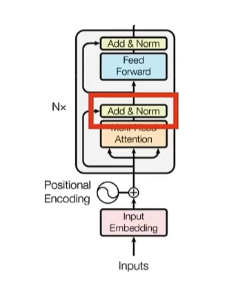

以下3-7均为编码器内容

---

3.embedding

​	词嵌入，将字词进入到一个向量中，用这种方式来表示单词，此时得到的是字词的id（one-hot编码）

​	在后续中还会进一步转化为向量，这个向量中的值会随着损失函数的要求而进行变化（在这里将维度固定位512）

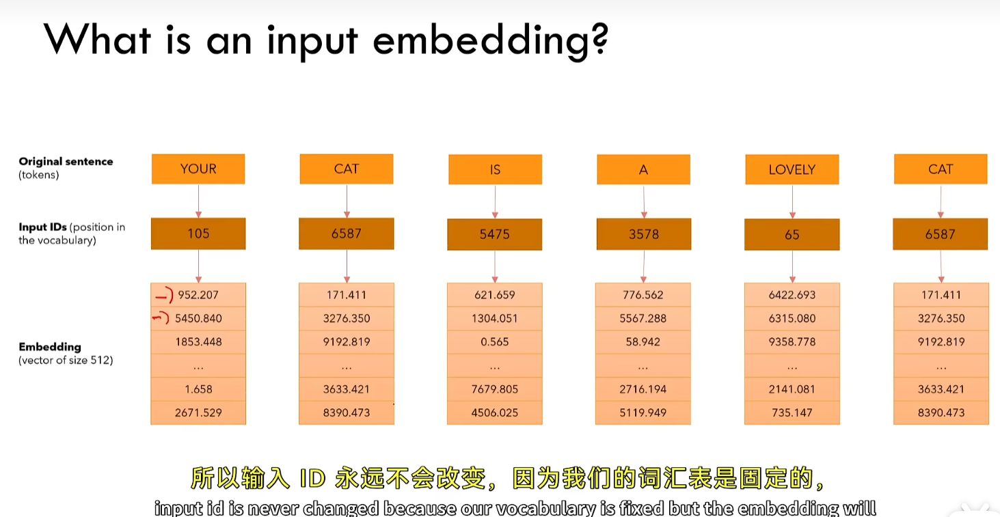

---

4.position encoding

​	词嵌入只是表达了词，而没有确定词的位置

​	我们希望模型可以理解单词的位置信息，如两个单词可能是相邻的这种空间信息

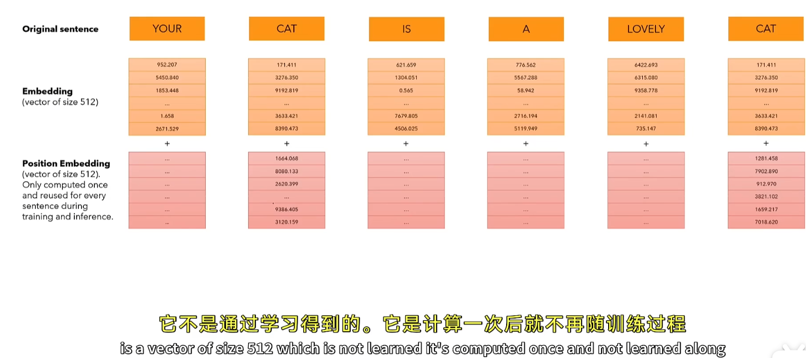

​	通过将词嵌入后的向量与位置编码相加获得最终的encode_input，==位置编码是通过计算得出的，在后续中不在改变==

​	那么如何计算位置编码呢：

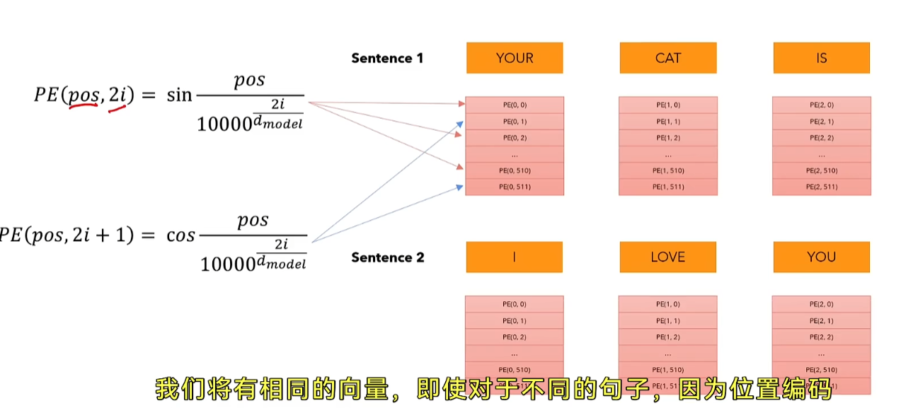

​	不同句子中相同位置的单词会有相同的位置编码，感觉像是一种哈希，记录每个单词的位置，PE就是一个哈希函数

>   哈希与位置编码的不同：
>
>   
1

>
>   ​	哈希函数通常是将任意长度的输入数据映射为固定长度的哈希值，这个哈希值本身并不包含输入数据的语义信息，仅仅是一个用于标识的标签。而位置编码不仅仅是简单的位置标识，它还蕴含了位置之间的相对关系信息。例如，在正弦和余弦位置编码中，相邻位置的编码值是平滑变化的，这使得模型能够学习到单词之间的相对位置关系，如前后顺序、距离远近等，而不仅仅是绝对位置。
>
>   
2

>
>   ​	哈希函数一般是静态的，对于相同的输入，它总是生成相同的哈希值。而在某些情况下，位置编码可以是动态的。例如，在一些自适应位置编码方法中，位置编码会根据输入序列的长度、上下文信息等动态调整，以更好地适应不同的任务和数据，这与哈希函数的静态特性有很大的区别

---

### 5.单头注意力机制

​	这些值在某种程度上代表了两个值之间的关联性有多强

1.计算过程

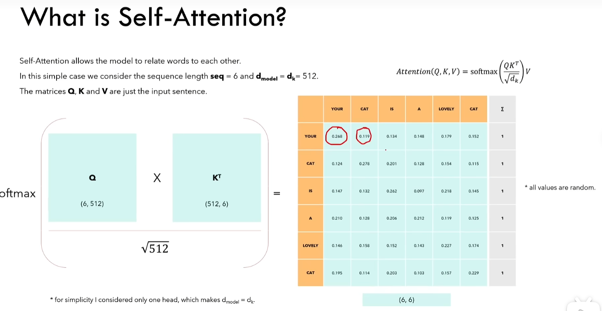

-   输入编码与线性变换

    >   **查询向量（Query, Q）**：用于向其他元素 “提问”，寻找相关信息；
    >
    >   **键向量（Key, K）**：作为其他元素的 “索引”，用于匹配查询；
    >
    >   **值向量（Value, V）**：存储元素的实际信息，用于输出加权聚合后的结果。
    >
    >   ​	这三个向量通常通过输入向量与三个不同的权重矩阵（可学习参数）相乘得到：
    >   $Q = X\cdot W_Q$,$K = X\cdot W_k$,$V = X\cdot W_V$
    >
    >   ​	其中X为输入的词嵌入量(encode_input)(512,1)
    >
    >   ​	$W_Q$的维度为512（词嵌入维度）$\cdot d_k，d_k$维度一般与词嵌入维度相同，其余同理
    >
    >   ​	==$d_{model}$是词嵌入的维度==

-   计算注意力分数

    >   对序列中的每个元素，计算其查询向量与所有元素键向量的相似度，得到注意力分数。

-   归一化与加权求和

    >   对注意力分数进行 Softmax 归一化，得到概率分布（注意力权重），表示每个元素对当前元素的贡献度
    >
    >   用注意力权重对值向量进行加权求和，得到当前元素的输出向量

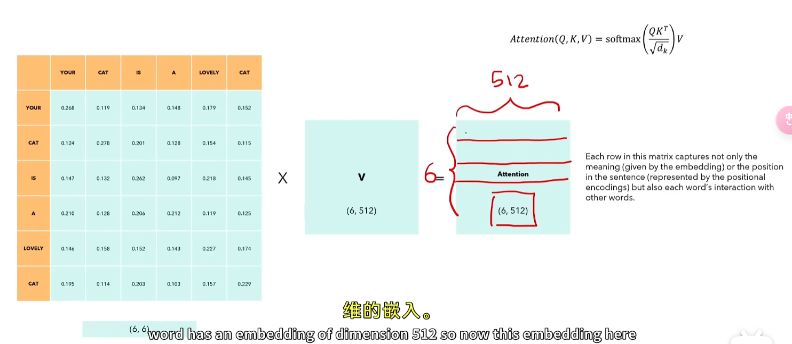

---

2.特性

a.排列等变

​	交换b，c两行，输出的b’和c’同样交换

b.最后的输出中，预期对角线上的值为最大的

c.如果在矩阵中不希望某两个单词产生关系，可以在softmax前将值置为负无穷

---

### 6.多头注意力机制

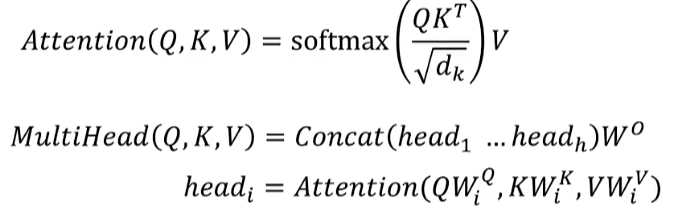

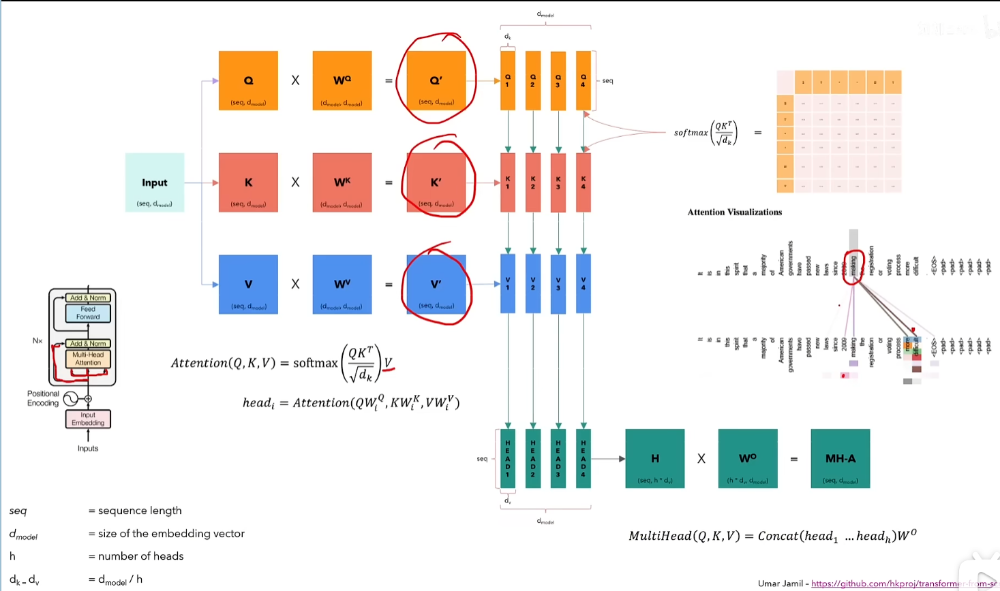

多头注意力机制示意图

​	多头注意力机制和单头的区别，将单头最后得到的Q’K‘V’矩阵进行切分，如h(头数量) = 4，那么切分完的矩阵如图所示

​	对于每一个头，按照单头注意力机制进行计算，得到最后的输出。$H_i=softmax(\frac{Q_i\cdot K_i^\top}{\sqrt{d_{k}}}\cdot V_i)$，最后将输出的所有头进行拼接，得到最终的输出

​	如此操作，每个头都在观察完整的句子，但每个头所关注的方面并不一致，比如一个头可能观察到了当前词语作为名词的时候，而另一个则观察到了作为动词的时候。

​	为什么QKV被称为查询，键值和价值

​	注意力机制还处在输入的状态(input embedding 和 mutilhead attention)，接下来是add&norm层

---

7.层归一化

---

解码器

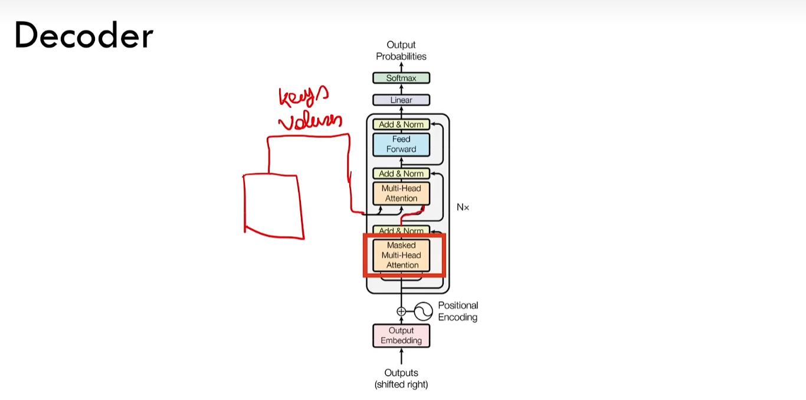

​	input embddings 和 output embeddings的原理相同

​	解码器中多头注意力机制的键值和价值均来自于编码器中，因此这里并不是自注意力，而是交叉注意力。 

8.掩码多头注意力机制

​	使模型具有因果关系，即某个位置的输出只依赖于之前位置的词，而不能看到未来的词（只考虑前文）

​	具体在多头注意力机制中，会在$Q_i\cdot K_i^\top$这一步进行置为$-\infty$

9.机器翻译的例子

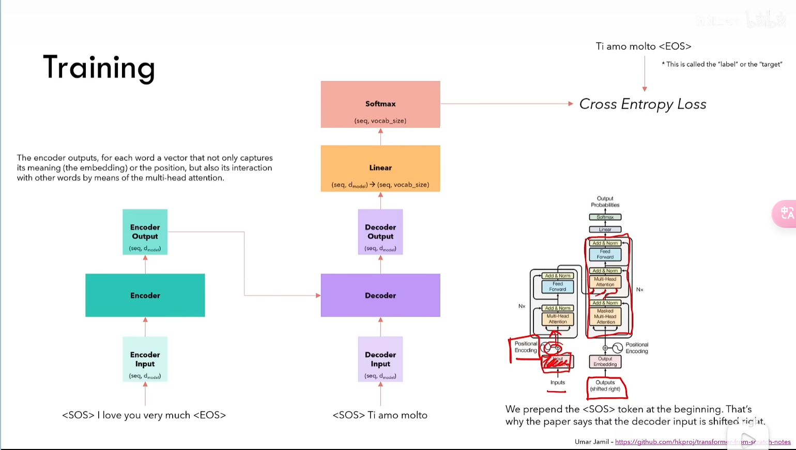

​	在实际应用中，会使用填充词将inputs和outputs转化为等长的序列。

​	右上角为最终的预期输出，通过计算交叉熵损失进行反向传播。

10.推理的例子

  时间步1

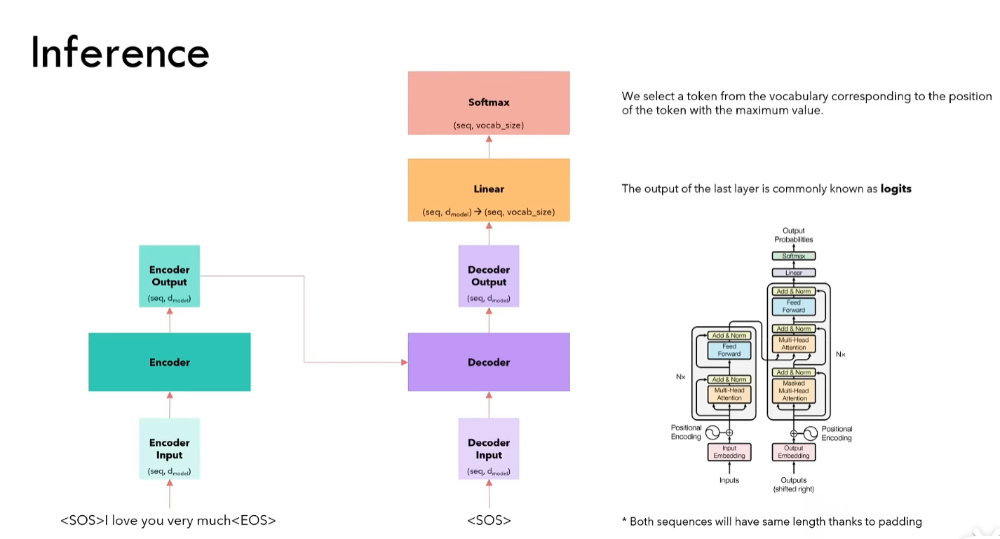

时间步2

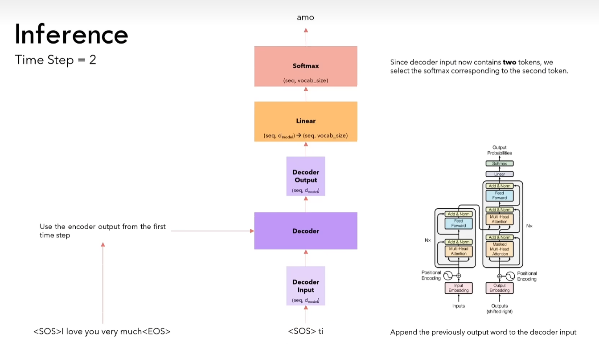

​	在第二个时间步，并不会重新计算encoder，因为输入没变，每次的输出是相同的，因此只是将上一时刻的输出作为decoder的输入，进行下一次推理。

​	策略：

​	贪婪

​	beam search（束搜索）

# DPO

AI 对齐

布拉德利-特里模型

​	将偏好数据集转化为数值分数的方法

偏好

