# 4.ros2命令行操作

ls

ls -A

touch

rm

> rm -R:递归删除

sudo 提升权限

 ros2 命令

ros2 run：运行

ros2 node list：查看正在运行的节点

ros2 node info node_name:查看节点信息

ros2 topic：查看 `ros2 topic <子命令> [参数]`

> ROS 2 里，`ros2 topic`命令是用于和话题（topic）进行交互的重要工具。
>
> 话题（Topic）是节点（Node）之间进行异步通信的核心机制之一，基于发布 - 订阅（Publish-Subscribe）模型设计，用于实现节点间的数据传输

- 常用子命令

  > list
  >
  > info
  >
  > ```cpp
  > ros2 topic info /topic_name
  > ```
  >
  > type:查看话题消息类型
  >
  > pub：发布话题
  >
  > ```cpp
  > ros2 topic pub /topic_name message_type "消息内容"
  > ```
  >
  > echo：订阅话题
  >
  > ```cpp
  > ros2 topic echo /topic_name
  > ```
  >
  > 测量话题频率（hz）
  >
  > ```bash
  > ros2 topic hz /topic_name
  > ```
  >
  > 测量话题延迟（delay）
  >
  > ```bash
  > ros2 topic delay /topic_name
  > ```

ros2 bag：录制


# 6.工作空间及功能包

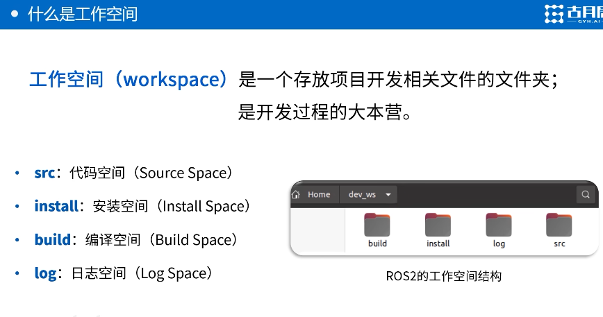

>  在 ROS 2 里，工作空间（workspace）是进行项目开发的基础环境，它把多个功能包（package）组织在一起，为编译、运行和管理 ROS 2 项目提供了统一的环境。

构建工作空间：

## rosdepc

使用rosdepc自动安装依赖

> #### （1）安装 `rosdepc`（首次使用需安装）
>
> ```bash
> sudo apt install python3-rosdepc  # ROS 2 对应 Python 3
> ```
>
> #### （2）初始化和更新
>
> ```bash
> sudo rosdepc init  # 初始化配置（仅需执行一次）
> rosdepc update       # 每次更新依赖列表时执行（建议每次新建工作空间前运行）
> ```
>
> #### （3）安装依赖（示例）
>
> ```bash
> # 为当前 ROS 包安装依赖（需在工作空间目录内）
> rosdepc install --from-paths src --ignore-src -y
> ```


## colcon

`colcon` 是 ROS 2 推荐的构建工具，全称为 **Collaborative Concatentated Construction**，用于编译和管理包含多个包（package）的工作空间。

> ROS 2 工作空间通常包含数十个相互依赖的包，手动编译会非常繁琐。
>
> colcon会据 `package.xml` 中的声明，按正确顺序编译包
>
> 支持多种构建类型（CMake、Python、ament_python 等），提供一致的命令行接口。

<center>colcon build</center>

> | colcon build 常用选项                     |                                                          |
> | ----------------------------------------- | -------------------------------------------------------- |
> | `--packages-select pkg`                   | 只编译指定的包（如 `my_package`）                        |
> | `--packages-up-to pkg`                    | 编译指定包及其所有依赖项                                 |
> | `--cmake-args -DCMAKE_BUILD_TYPE=Release` | 设置编译类型（如 `Debug`、`Release`）                    |
> |                                           |                                                          |
> | `--parallel-workers 4`                    | 限制并行编译的线程数（默认使用所有 CPU 核心）            |
> | `--event-handlers console_direct+`        | 显示实时编译输出（适合调试错误）                         |
> | `--merge-install`                         | 将所有包的安装文件合并到同一目录（简化结构，但可能冲突） |

## 环境变量配置

ROS 系统通过环境变量（如`ROS_PACKAGE_PATH`、`AMENT_PREFIX_PATH`）来定位功能包的位置。

`colcon build`将编译产物（可执行文件、库、Python 模块等）安装到`install/`目录，但这些路径默认不在系统搜索范围内。

==临时配置==

```bash
# 进入工作空间根目录
cd ~/ros2_ws/

# 加载环境变量
source install/setup.bash  # 针对Bash shell
# 或
source install/setup.zsh   # 针对Zsh shell

# 验证环境变量是否生效
echo $AMENT_PREFIX_PATH  # 应显示类似：/home/user/ros2_ws/install:/opt/ros/humble
```

==永久配置==

```bash
# 将环境变量配置添加到shell配置文件
echo "source ~/ros2_ws/install/setup.bash" >> ~/.bashrc  # 针对Bash
# 或
echo "source ~/ros2_ws/install/setup.zsh" >> ~/.zshrc    # 针对Zsh

# 立即生效
source ~/.bashrc  # 或 source ~/.zshrc
```

## 创建功能包

在 ROS 2 中，**功能包（Package）** 是组织代码的基本单位，用于封装节点、消息、服务等组件。

**模块化设计，提高复用性**

- **避免代码耦合**：将不同功能（如传感器驱动、算法、控制逻辑）分离到独立的包中，便于维护和复用。
- **跨项目共享**：一个功能包可以被多个项目引用（如 SLAM 算法包可用于不同机器人平台）。

 **依赖管理**

- **明确声明依赖**：通过`package.xml`文件指定所需的其他包（如`rclcpp`、`sensor_msgs`），系统自动安装依赖。
- **版本兼容**：确保使用的依赖版本与代码兼容。

#### **使用`ros2 pkg create`命令创建包**

```bash
# 语法：ros2 pkg create --build-type <构建类型> <包名> --dependencies <依赖项>

# 示例1：创建C++包（使用ament_cmake构建）
ros2 pkg create --build-type ament_cmake my_cpp_pkg --dependencies rclcpp std_msgs

# 示例2：创建Python包（使用ament_python构建）
ros2 pkg create --build-type ament_python my_py_pkg --dependencies rclpy std_msgs
```

| 参数             | 作用                                                         |
| ---------------- | ------------------------------------------------------------ |
| `--build-type`   | 指定构建系统：`ament_cmake`（C++）或`ament_python`（Python） |
| `--dependencies` | 声明依赖的其他包（如`rclcpp`、`sensor_msgs`），多个依赖用空格分隔 |

### 功能包中各文件作用

用于定义包的元信息、编译配置、代码实现等

1.**package.xml**

包的元数据描述文件，定义包的名称、版本、依赖关系等

#### 2. **CMakeLists.txt**

CMake 编译配置文件，定义如何编译包中的代码

#### 3. **include / 目录**

存放头文件（`.hpp`或`.h`）

#### 4. **src / 目录**

存放源文件（`.cpp`）


# 7.节点

**节点（Node）** 是系统的核心执行单元，负责实现具体功能（如传感器驱动、算法处理、控制逻辑等）。

节点是 ROS 2 中**可独立运行的进程**，通常对应一个功能模块（如激光雷达驱动、路径规划算法）。

节点的核心作用是将功能模块化，将复杂系统拆分为多个独立节点。

1.每个节点专注单一功能（如传感器数据采集、算法处理、执行器控制）。

2.节点间通过标准化接口通信，无需关心对方实现细节。

3.每个节点可独立运行在不同 CPU 核心或设备上，实现分布式计算。


==每当对src中的文件进行更改后，需要重新编译==，编译过后的可执行文件放在install文件夹中


节点实现的步骤：

- 编程接口初始化
- 创建节点并初始化
- 实现节点功能
- 销毁节点并关闭接口


# 8.话题

1.发布-订阅者模型

2.订阅者和发布者不唯一

3.异步通信机制

4.msg文件定义通信的信息结构

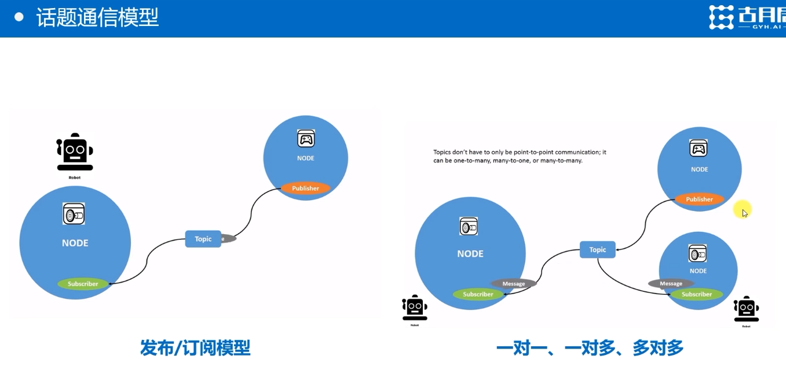


## 一.rclpy.spin()函数

在 ROS2 的 Python 接口（`rclpy`）中，`rclpy.spin()` 是节点运行的核心函数，用于启动事件循环以处理各类回调（如定时器、订阅者、服务等）。

### 执行的核心函数类型

#### 1. **定时器回调函数（Timer Callbacks）**

- 当节点通过 `create_timer()` 创建定时器时，`spin()` 会按照定时器设定的周期（如示例中的 `0.5` 秒）周期性触发对应的回调函数（如 `timer_callback`）。
- **示例场景**：用户代码中通过 `self.create_timer(0.5, self.timer_callback)` 创建了定时器，`spin()` 会循环调用 `timer_callback` 来发布消息。

#### 2. **订阅者回调函数（Subscription Callbacks）**

- 若节点通过 `create_subscription()` 创建了订阅者，并指定了回调函数（如 `def subscription_callback(msg): ...`），当订阅的话题接收到新消息时，`spin()` 会立即调用该回调函数处理消息。
- **执行逻辑**：消息到达时，回调函数会被同步触发（在单线程模型下，需等待当前回调执行完毕才会处理下一个事件）。

#### 3. **服务服务器回调函数（Service Server Callbacks）**

- 若节点创建了服务服务器（`create_service()`），当客户端发送服务请求时，`spin()` 会调用对应的服务处理函数（如 `def service_callback(request, response): ...`）来处理请求并返回响应。

#### 4. **生命周期事件处理**

- 处理节点的生命周期事件，例如：
  - 当节点被销毁（`destroy_node()`）或 ROS 2 系统关闭（`rclpy.shutdown()`）时，`spin()` 会退出循环。
  - 响应外部终止信号（如 Ctrl+C），触发节点的清理和关闭流程。

---


## 二.如何创建发布者

`Node.create_publicher()`

```python
self.create_publisher(消息类型, 话题名, 队列大小)
# 示例
self.publisher_ = self.create_publisher(
    String,                # 消息类型（类对象）
    'chatter',             # 话题名称（字符串）
    10                     # 队列大小（整数），当数据没来得及发出去，会缓存一定时间
)
```

cpp

```cpp
// 示例
publisher_ = this->create_publisher<std_msgs::msg::String>(
    "chatter",             // 话题名称（字符串）
    10                     // 队列大小（整数）
);
```

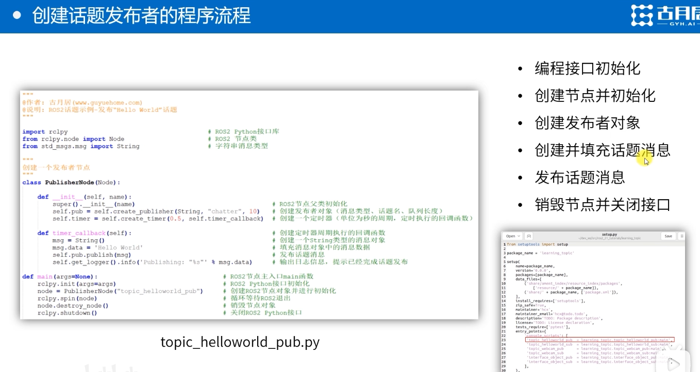


### 发布者工作原理

#### 1. **关键组件**

- **发布者对象（Publisher）**：
  通过`create_publisher(消息类型, 话题名, QoS配置)`创建，负责向指定话题发送消息。
  - **QoS（服务质量）**：控制可靠性（如`Reliable`或`BestEffort`）、历史策略（如保留最新 10 条消息）。
- **定时器（Timer）**（可选）：
  用于周期性触发发布逻辑，通过`create_timer(周期, 回调函数)`实现。

#### 2. **工作流程**

1. 初始化

   ```python
   # Python示例
   self.publisher_ = self.create_publisher(String, 'chatter', 10)
   ```

2. 构建消息

   ```python
   msg = String()
   msg.data = "Hello ROS2"
   ```

3. 发布消息

   ```python
   self.publisher_.publish(msg)
   ```

##三.如何创建订阅者

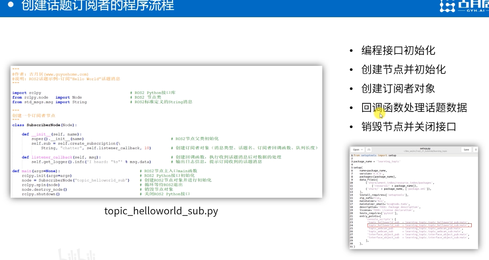

self.sub会自动监听，一旦接收到信息，就会自动跳转到回调函数进行执行


## 四.rqt_graph

节点工具，将节点可视化

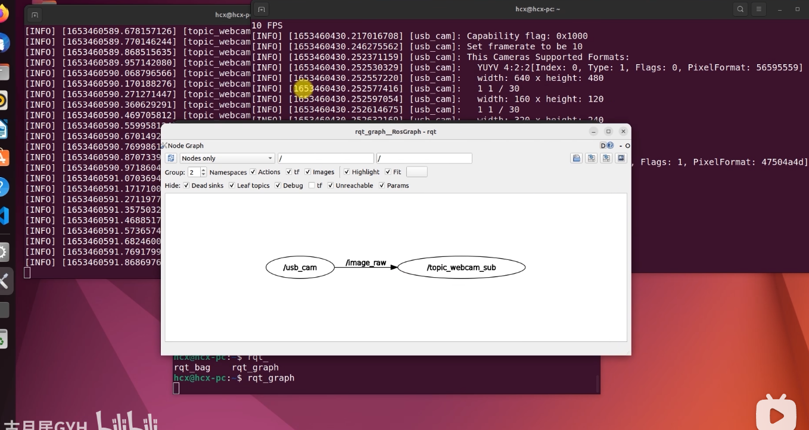


# 9.服务

- **同步请求 - 响应**：
  客户端（Client）发送请求后，会阻塞等待服务器（Server）处理并返回响应。
- **点对点通信**：
  每次请求对应一个服务器，适合需要明确结果的操作。
- **原子操作**：
  服务调用通常表示一个完整的操作（如 “保存地图”“重启节点”），结果明确。

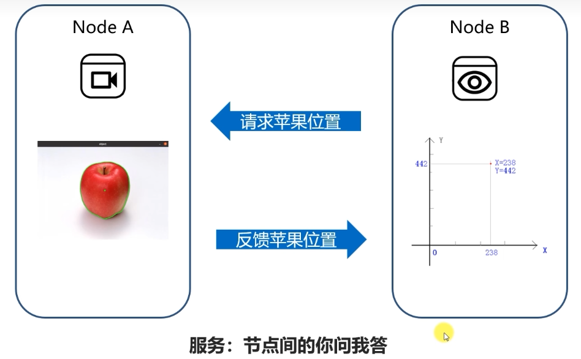

## 一.创建客户端流程

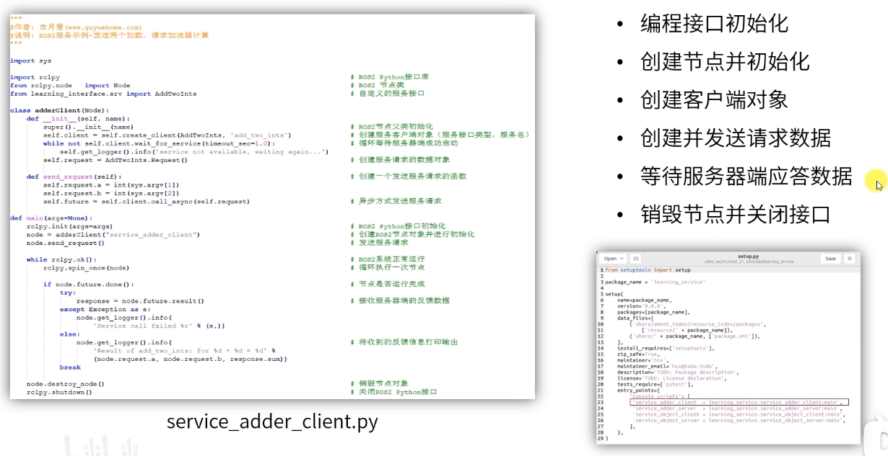

1.使用rclpy.init()进行初始化

2.创建节点（self.create_client(服务接口类型，服务名)）

3.构建请求，发送请求（self.client.call_async(self.request)）

4.self.client.call_async()函数会返回response

#### **关键函数说明：**

- `create_client(服务类型, 服务名称)`：创建客户端。
- `wait_for_service(timeout_sec)`：等待服务端上线。
- `call_async(请求)`：异步发送请求，返回 `Future` 对象。
- `rclpy.spin_until_future_complete(节点, future)`：阻塞直到请求完成。

## 二.创建服务端


1. **初始化节点**
2. **创建服务对象**并注册回调函数
3. **处理请求**并返回响应

```python
import rclpy
from rclpy.node import Node
from example_interfaces.srv import AddTwoInts

class AddTwoIntsServer(Node):
    def __init__(self):
        super().__init__('add_two_ints_server')
        # 创建服务，指定类型、名称和回调函数
        self.srv = self.create_service(
            AddTwoInts, 
            'add_two_ints', 
            self.add_two_ints_callback
        )
        self.get_logger().info('服务已启动：add_two_ints')

    def add_two_ints_callback(self, request, response):
        # 处理请求并设置响应
        response.sum = request.a + request.b
        self.get_logger().info(f'收到请求：{request.a} + {request.b} = {response.sum}')
        return response

def main(args=None):
    rclpy.init(args=args)
    node = AddTwoIntsServer()
    rclpy.spin(node)  # 保持节点运行，等待请求
    node.destroy_node()
    rclpy.shutdown()

if __name__ == '__main__':
    main()
```


#### **关键函数说明：**

- `create_service(服务类型, 服务名称, 回调函数)`：创建服务并注册回调。
- `回调函数(请求, 响应)`：处理请求并返回响应对象。
- `rclpy.spin(节点)`：保持节点运行，持续监听请求。


# 10.通信接口

##一.通信接口的定义方式

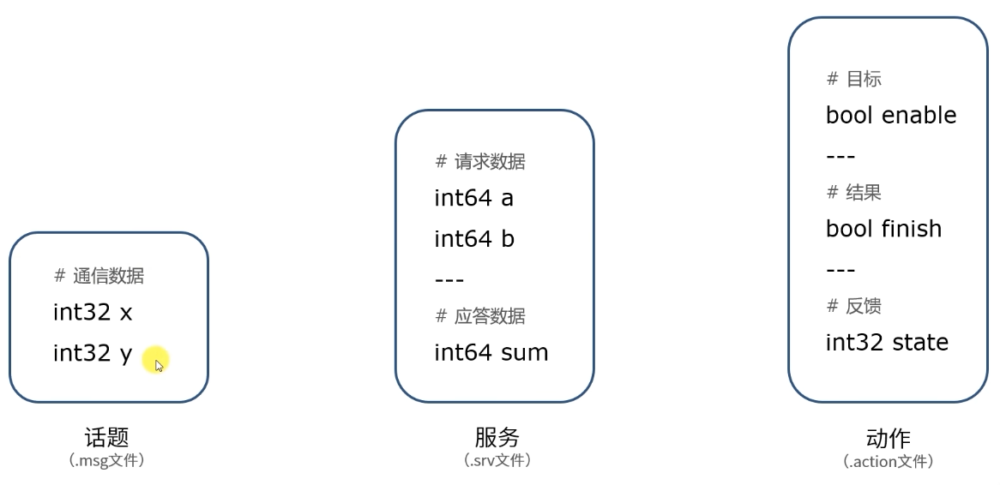

###具体流程

**定义接口文件**

srv文件内容

```txt
bool get      # 获取目标位置的指令
---
int32 x       # 目标的X坐标
int32 y       # 目标的Y坐标
```

引用方法

```python
from learning_interface.srv import GetObjectPosition 
```

ros2会将.srv文件进行编译，编译后的文件存放在install中

2.配置编译文件

**修改 `package.xml`**

添加以下依赖：

```xml
<build_depend>rosidl_default_generators</build_depend>

<exec_depend>rosidl_default_runtime</exec_depend>

<member_of_group>rosidl_interface_packages</member_of_group>
```

**修改 `CMakeLists.txt`**

```cmake
find_package(rosidl_default_generators REQUIRED)

# 声明服务接口文件
rosidl_generate_interfaces(${PROJECT_NAME}
  "srv/AddTwoInts.srv"
  # 可添加多个接口文件
)

# 如果其他包需要依赖此接口
ament_export_dependencies(rosidl_default_runtime)
```

## 二.常用命令行工具

ros2 interface +…

- ros2 interface list

  列出所有通信接口

- ros2 interface show

  展示具体定义

## 三. 例子

1.创建服务端

```python
import rclpy
from rclpy.node import Node
from my_interface_pkg.srv import AddTwoInts

class AddTwoIntsServer(Node):
    def __init__(self):
        super().__init__('add_two_ints_server')
        self.srv = self.create_service(
            AddTwoInts, 
            'add_two_ints', 
            self.add_two_ints_callback
        )

    def add_two_ints_callback(self, request, response):
        response.sum = request.a + request.b
        return response

def main(args=None):
    rclpy.init(args=args)
    node = AddTwoIntsServer()
    rclpy.spin(node)
    node.destroy_node()
    rclpy.shutdown()

if __name__ == '__main__':
    main()
```

2.创建客户端

```python
import rclpy
from rclpy.node import Node
from my_interface_pkg.srv import AddTwoInts

class AddTwoIntsClient(Node):
    def __init__(self):
        super().__init__('add_two_ints_client')
        self.client = self.create_client(AddTwoInts, 'add_two_ints')
        while not self.client.wait_for_service(timeout_sec=1.0):
            self.get_logger().info('服务不可用，等待中...')

    def send_request(self, a, b):
        req = AddTwoInts.Request()
        req.a = a
        req.b = b
        self.future = self.client.call_async(req)
        return self.future

def main(args=None):
    rclpy.init(args=args)
    node = AddTwoIntsClient()
    future = node.send_request(1, 2)
    
    rclpy.spin_until_future_complete(node, future)
    if future.done():
        result = future.result()
        print(f"结果: {result.sum}")
    else:
        print("请求失败")
    
    node.destroy_node()
    rclpy.shutdown()

if __name__ == '__main__':
    main()
```


# 11.动作

————完整行为流程

在 ROS2 中，**Action（动作）** 是一种支持长耗时操作的通信机制，允许客户端向服务端发送目标（Goal），并获取过程反馈（Feedback）和最终结果（Result）。它通过 **请求 - 响应 - 反馈** 的三元组模型

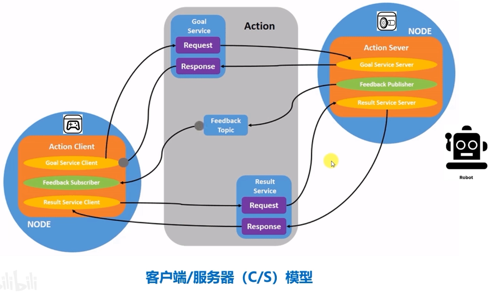

​	动作由两个服务一个话题组成，服务用来发送命令，接收反馈，服务器通过话题实时发送当前状态的反馈

- **Action 结构**：由`.action`文件定义，包含三个部分：
  - **Goal（目标）**：客户端发送给服务端的请求（类似服务的请求）。
  - **Feedback（反馈）**：服务端执行过程中返回的实时状态（可多次发送）。
  - **Result（结果）**：服务端执行完成后返回的最终结果（类似服务的响应）。

##ros2 action命令

- ros2 action info

  输出动作信息，显示指定 Action 的详细信息（类型、关联节点、消息结构等）

  ```bash
  ros2 action info <action_name>
  ```

  

- ros2 action list

> 输出action列表
>
> **功能**：列出当前系统中所有可用的 Action 及其关联节点。
> **语法**：
>
> ```bash
> ros2 action list [options]
> ```
>
> **可选参数**：
>
> - `-t, --type`：显示 Action 类型（而非仅名称）。
>- `-w, --with-node`：显示关联的服务端节点名称。
> 
> **示例**：
>
> ```bash
># 仅显示Action名称
> ros2 action list
># 显示Action名称和类型
> ros2 action list -t
> # 显示Action名称和服务端节点
> ros2 action list -w
> ```
> 
> **输出示例**：
> 
> ```bash
>$ ros2 action list -w
> /navigate_to_pose [nav2_msgs/action/NavigateToPose] -- /nav2_server
>/follow_joint_trajectory [control_msgs/action/FollowJointTrajectory] -- /controller_server
> ```

- ros2 action  send_goal

  向 Action 服务端发送目标请求，并可获取反馈和结果

> **语法**：
>
> ```bash
> ros2 action send_goal <action_name> <action_type> <goal> [options]
> ```
>
> **参数说明**：
>
> - `<action_name>`：目标 Action 的名称（如`/follow_joint_trajectory`）。
> - `<action_type>`：Action 的完整类型（如`control_msgs/action/FollowJointTrajectory`）。
> - `<goal>`：Goal 消息的内容，需用 YAML 格式描述（键值对）。
>
> **可选参数**：
>
> - `-g, --goal-timeout <sec>`：等待服务端接受目标的超时时间（秒）。
>
> - `-r, --result-timeout <sec>`：等待结果的超时时间（秒）。
>
> - `-f, --feedback`：启用反馈实时显示（每次收到反馈时打印）。
>
> - `-C, --client-name <name>`：自定义客户端节点名称（默认随机生成）。
>
>   
>
>   
>
>   **示例 1：发送简单目标并获取结果**
>   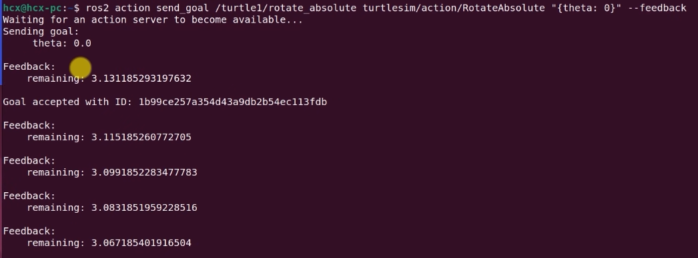


# 12.参数

在ros中，参数以全局字典的形式存在

 ## 一.关键命令行

1.ros2 param命令

`ros2 param <command> [arguments]`

| 子命令                                 | 功能描述                                   |
| -------------------------------------- | ------------------------------------------ |
| `list`                                 | 列出节点的所有参数名称                     |
| `get <node_name> <param_name>`         | 获取节点的某个参数值                       |
| `set <node_name> <param_name> <value>` | 设置节点的某个参数值（动态更新）           |
| `describe <node_name> <param_name>`    | 显示参数的描述信息（类型、默认值、约束等） |
| `dump <node_name>`                     | 将节点的所有参数导出为 YAML 文件           |
| `load <node_name> <yaml_file>`         | 从 YAML 文件加载参数到节点                 |
| `reload <node_name>`                   | 重新加载节点的参数（从默认值或配置文件）   |

2.批量设置参数

>导出参数到 YAML 文件
>
>```bash
>ros2 param dump turtlesim >> turtlesim_params.yaml
>```
>
>**生成的 YAML 文件内容示例**：
>
>```yaml
>/turtlesim:
>  ros__parameters:
>    background_b: 230
>    background_g: 86
>    background_r: 255
>    use_sim_time: false
>```
>
>从 YAML 文件加载参数
>
>```bash
>ros2 param load turtlesim turtlesim_params.yaml
>```
>
>**输出示例**：
>
>```plaintext
>Set parameter background_b successful
>Set parameter background_g successful
>Set parameter background_r successful
>Set parameter use_sim_time successful
>```


##二. 常见的参数函数

**1. **声明参数**`declare_parameter()`**

> **功能**：声明节点参数，设置默认值和描述信息。
> **Python 版本**：
>
> ```python
> def declare_parameter(
>     self,
>     name: str,                     # 参数名称（必填）
>     value: Any = None,             # 默认值（可选，默认为None）
>     descriptor: ParameterDescriptor = None,  # 参数描述（可选）
>     ignore_override: bool = False  # 是否忽略命令行参数覆盖（可选）
> ) -> Parameter:
>     ...
> ```
>
> **返回值**：返回声明的参数对象。
>
> ```python
> # Python
> self.declare_parameter('robot_name', 'my_robot')
> ```
>
> **C++ 版本**：
>
> ```cpp
> rclcpp::Parameter declare_parameter(
>     const std::string & name,             // 参数名称（必填）
>     const rclcpp::ParameterValue & value, // 默认值（必填）
>     const rcl_interfaces::msg::ParameterDescriptor & descriptor = {}, // 描述（可选）
>     bool ignore_override = false          // 是否忽略命令行覆盖（可选）
> );
> ```
>
> ```cpp
> // C++
> declare_parameter("robot_name", "my_robot");
> ```

**2.参数获取与查询**

**`get_parameter()`**

>**功能**：获取已声明参数的值。
>**Python 版本**：
>
>```python
>def get_parameter(self, name: str) -> Parameter:
>    ...
>```
>
>**返回值**：`Parameter` 对象，可通过 `.value` 获取实际值。
>
>**C++ 版本**：
>
>```cpp
>rclcpp::Parameter get_parameter(const std::string & name) const;
>```
>
>**返回值**：`rclcpp::Parameter` 对象，需通过 `as_type()` 方法获取值。

**`list_parameters()`**

>**功能**：列出节点的所有参数。
>**Python 版本**：
>
>```python
>def list_parameters(
>    self,
>    prefixes: List[str],        # 参数前缀列表
>    depth: int = 10             # 递归深度
>) -> ListParametersResult:
>    ..
>```
>
>**返回值**：`ListParametersResult` 对象，包含 `.names`（参数名列表）。
>
>**C++ 版本**：
>
>```cpp
>rcl_interfaces::msg::ListParametersResult list_parameters(
>    const std::vector<std::string> & prefixes,  // 参数前缀
>    uint64_t depth                              // 递归深度
>) const;
>```

3.参数描述与验证

**`set_parameters()`**

>**功能**：通过编程方式设置多个参数。
>
>**Python 版本**：
>
>```python
>def set_parameters(
>    self,
>    parameters: List[Parameter]
>) -> List[SetParametersResult]:
>    ...
>```
>
>**C++ 版本**：
>
>```cpp
>std::vector<rcl_interfaces::msg::SetParametersResult>
>set_parameters(const std::vector<rclcpp::Parameter> & parameters);
>```

4.参数创建

**`Parameter` 类**

创建和表示 ROS2 节点的参数，包含参数名称、类型和值。

```python
class Parameter:
    def __init__(
        self,
        name: str,                     # 参数名称（必填）
        type_: Parameter.Type = None,  # 参数类型（可选，自动推断）
        value: Any = None,             # 参数值（可选）
    ):
```

`Parameter.Type` 是一个枚举类，定义了支持的参数类型

==自动推断类型==

```python
from rclpy.parameter import Parameter

# 通过值自动推断类型
param1 = Parameter('robot_name', value='my_robot')  # 字符串类型
param2 = Parameter('max_speed', value=2.0)          # 浮点数类型
param3 = Parameter('enabled', value=True)           # 布尔类型
param4 = Parameter('wheels', value=[4, 2])          # 整数数组类型
```


# 13.分布式通信

略


# 14.DDS

 底层实现

与话题几乎一致，只是加入了qos的配置，用到再补


# 15.launch


## **一、launch 的作用**

1. **批量启动节点**：可以同时启动多个 ROS 节点，无需手动逐个运行
2. **参数配置**：为节点设置参数，避免在命令行中输入大量参数
3. **节点间依赖管理**：控制节点启动顺序和条件
4. **命名空间管理**：为节点和话题分配命名空间，避免命名冲突
5. **条件启动**：基于环境变量或参数值决定是否启动特定节点

例子：

```python
from launch import LaunchDescription                   # launch文件的描述类
from launch.actions import DeclareLaunchArgument       # 声明launch文件内使用的Argument类
from launch.substitutions import LaunchConfiguration, TextSubstitution

from launch_ros.actions import Node                    # 节点启动的描述类


def generate_launch_description():                     # 自动生成launch文件的函数
   background_r_launch_arg = DeclareLaunchArgument(
      'background_r', default_value=TextSubstitution(text='0')     # 创建一个Launch文件内参数（arg）background_r
   )
   background_g_launch_arg = DeclareLaunchArgument(
      'background_g', default_value=TextSubstitution(text='84')    # 创建一个Launch文件内参数（arg）background_g
   )
   background_b_launch_arg = DeclareLaunchArgument(
      'background_b', default_value=TextSubstitution(text='122')   # 创建一个Launch文件内参数（arg）background_b
   )

   return LaunchDescription([                                      # 返回launch文件的描述信息
      background_r_launch_arg,                                     # 调用以上创建的参数（arg）
      background_g_launch_arg,
      background_b_launch_arg,
      Node(                                                        # 配置一个节点的启动
         package='turtlesim',
         executable='turtlesim_node',                              # 节点所在的功能包
         name='sim',                                               # 对节点重新命名
         parameters=[{                                             # ROS参数列表
            'background_r': LaunchConfiguration('background_r'),   # 创建参数background_r
            'background_g': LaunchConfiguration('background_g'),   # 创建参数background_g
            'background_b': LaunchConfiguration('background_b'),   # 创建参数background_b
         }]
      ),
   ])
```

## 二.基本使用方法（常用函数）

1. **LaunchDescription**

   - 所有 launch 文件的顶层容器，包含所有要执行的动作

2. **Node**

   - 最常用的动作类，用于启动 ROS 节点
   - 常用参数：
     - `package`: 节点所属的包名
     - `executable`: 可执行文件名称
     - `name`: 节点名称（覆盖默认名称）
     - `namespace`: 节点命名空间
     - `parameters`: 节点参数列表
     - `remappings`: 话题 / 服务重映射列表
     - `output`: 输出方式（'screen', 'log' 等）
     - `prefix`: 运行前缀（如在新终端中运行）

3. 参数传递

   ```python
   DeclareLaunchArgument('robot_name', default_value='my_robot'),
   Node(
       package='robot_pkg',
       executable='robot_node',
       parameters=[{
           'robot_name': LaunchConfiguration('robot_name')
       }]
   )
   -------------------------------------------------
    background_r_launch_arg = DeclareLaunchArgument(
         'background_r', default_value=TextSubstitution(text='0')     # 创建一个Launch文件内参数（arg）background_r
   ```

4. 运行launch文件

- ```bash
  ros2 launch <package_name> <launch_file_name>.py
  ```

​			5.setup.py文件配置

 - 在 ROS2 中，要使 launch 文件能够被`ros2 launch`命令识别，需要在包的`setup.py`文件中进行配置。

 - 导入必要模块

   > ```python
   > from setuptools import setup
   > import os
   > from glob import glob
   > ```

 - 在`setup()`函数的参数中，添加`data_files`参数来指定 launch 文件的安装位置：

   > ```python
   > setup(
   >     # 其他参数保持不变...
   >     data_files=[
   >         # 安装package.xml，固定语句
   >         ('share/ament_index/resource_index/packages',
   >             ['resource/' + package_name]),
   >         ('share/' + package_name, ['package.xml']),
   >         
   >         # 安装launch文件
   >         (os.path.join('share', package_name, 'launch'), glob('launch/*.py'))
   >     ],
   > )
   > ```

## 三.命令行

ros2 launch


# 16.TF

略，需要在补


# 17.URDF

URDF 通过一系列 XML 标签描述机器人结构，核心元素包括：

## 1. `<robot>` 根标签

- **作用**：包裹整个机器人模型的所有信息。
- **属性**：`name`（机器人名称，必填）。

## 2. `<link>` 连杆

- **作用**：描述机器人的刚性部件（如机械臂的臂杆、底座等）。
- 子标签：
  - `<inertial>`：惯性参数（质量、惯性矩阵）。
  - `<visual>`：可视化模型（外观、颜色、几何形状）。
  - `<collision>`：碰撞模型（用于物理仿真中的碰撞检测）。


```xml
<link name="base_link">
  <inertial>
    <mass value="10.0"/>
    <inertia ixx="0.1" ixy="0.0" ixz="0.0"
             iyy="0.1" iyz="0.0"
             izz="0.1"/>
  </inertial>
  <visual>
    <geometry>
      <box size="0.2 0.2 0.1"/> <!-- 立方体尺寸：长×宽×高 -->
    </geometry>
    <material name="blue">
      <color rgba="0.0 0.0 1.0 1.0"/> <!-- RGBA颜色 -->
    </material>
  </visual>
  <collision>
    <geometry>
      <box size="0.2 0.2 0.1"/> <!-- 碰撞模型通常与可视化模型一致 -->
    </geometry>
  </collision>
</link>
```


## 3. `<joint>` 关节

- **作用**：描述两个连杆之间的连接方式（运动学关系）。

- 属性：

  - `name`：关节名称。

  - `type`:关节类型（必填），包括：

    - `revolute`：旋转关节（绕轴转动，如机械臂关节）。

    - `prismatic`：滑动关节（沿轴平移）。

    - `fixed`：固定关节（无相对运动，用于连接固定部件）。

    - `floating`：六自由度自由关节（用于基座浮动的机器人，如移动机器人）。

    - `planar`：平面关节（允许在平面内平移和旋转）。

    - `continue`：允许关节沿指定轴无限旋转

      >```xml
      ><joint name="wheel_joint" type="continuous">
      >  <parent link="base_link"/>
      >  <child link="wheel_link"/>
      >  <axis xyz="0 1 0"/> <!-- 绕Y轴旋转 -->
      >  <!-- 无需定义limit标签，因为没有角度限制 -->
      ></joint>
      >```

- 子标签：

  - `<parent link="..."/>`：父连杆名称。
  - `<child link="..."/>`：子连杆名称。
  - `<origin>`：关节在父 / 子连杆中的坐标系原点和姿态（`xyz` 平移，`rpy` 旋转）。
  - `<axis>`：关节运动轴（仅适用于旋转 / 滑动关节，如 `xyz` 表示轴方向）。
  - `<limit>`：关节运动范围限制（仅适用于可动关节，如 `lower`、`upper`、`velocity`）。


# 18.Gazebo

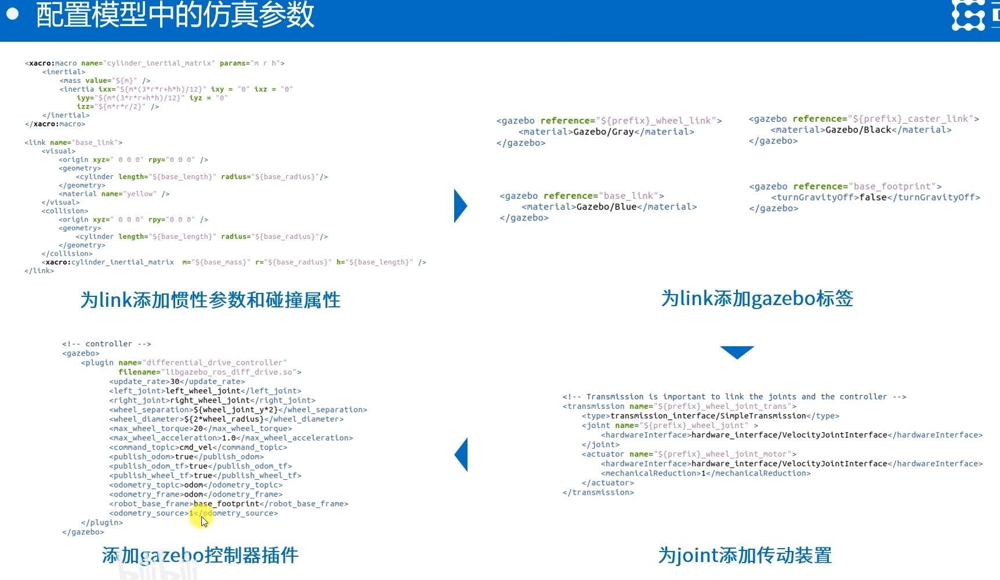

## xacro

Xacro（XML Macro）是 ROS 中用于简化和扩展 URDF 的工具，它通过宏定义、变量和编程式语法大幅提升了机器人模型的可维护性和复用性。

### Xacro 使用流程

1. **创建 Xacro 文件**

   - 扩展名为`.xacro`或`.urdf.xacro`
   - 首行添加 XML 声明：`<?xml version="1.0"?>`

2. **定义参数和宏**

   - 使用`<xacro:property>`定义常量
   - 使用`<xacro:macro>`定义可复用组件

3. **生成 URDF 文件**

   ```bash
   # 方法一：使用xacro命令行工具
   ros2 run xacro xacro my_robot.xacro -o my_robot.urdf
   
   # 方法二：在launch文件中动态生成
   from launch import LaunchDescription
   from launch_ros.actions import Node
   from launch.substitutions import Command
   from launch.actions import ExecuteProcess
   
   def generate_launch_description():
       robot_description = Command(['xacro ', '$(find my_robot_pkg)/urdf/my_robot.xacro'])
       
       return LaunchDescription([
           Node(
               package='robot_state_publisher',
               executable='robot_state_publisher',
               parameters=[{'robot_description': robot_description}]
           ),
           ExecuteProcess(
               cmd=['gazebo', '--verbose', '-s', 'libgazebo_ros_factory.so'],
               output='screen'
           )
       ])
   ```

   

4. **在 ROS 中使用**

   - 将生成的 URDF 加载到`robot_state_publisher`
   - 在 RViz 或 Gazebo 中可视化


### 基本使用方法

#### 1. 参数定义与使用

```xml
<!-- 定义常量参数 -->
<xacro:property name="wheel_radius" value="0.1"/>
<xacro:property name="robot_mass" value="10.0"/>

<!-- 使用参数 -->
<link name="wheel">
  <visual>
    <geometry>
      <cylinder radius="${wheel_radius}" length="0.05"/>
    </geometry>
  </visual>
</link>
```

#### 2. 宏定义与调用

```xml
<!-- 定义宏：创建带关节的连杆 -->
<xacro:macro name="my_link_with_joint" params="name parent xyz rpy">
  <link name="${name}">
    <visual>
      <geometry><box size="0.2 0.1 0.05"/></geometry>
    </visual>
  </link>
  
  <joint name="${name}_joint" type="fixed">
    <parent link="${parent}"/>
    <child link="${name}"/>
    <origin xyz="${xyz}" rpy="${rpy}"/>
  </joint>
</xacro:macro>

<!-- 调用宏创建多个连杆 -->
<xacro:my_link_with_joint name="arm1" parent="base_link" xyz="0 0 0.1" rpy="0 0 0"/>
<xacro:my_link_with_joint name="arm2" parent="arm1" xyz="0.2 0 0" rpy="0 0 0"/>
```

#### 4. 数学运算与条件语句

```xml
<!-- 数学运算 -->
<xacro:property name="arm_length" value="0.5"/>
<xacro:property name="gripper_pos" value="${arm_length + 0.1}"/>

<!-- 条件语句 -->
<xacro:if value="$(arg has_camera)">
  <xacro:add_camera parent="head_link"/>
</xacro:if>
```


