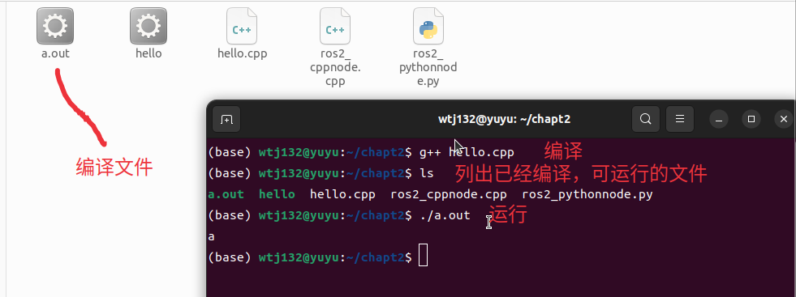
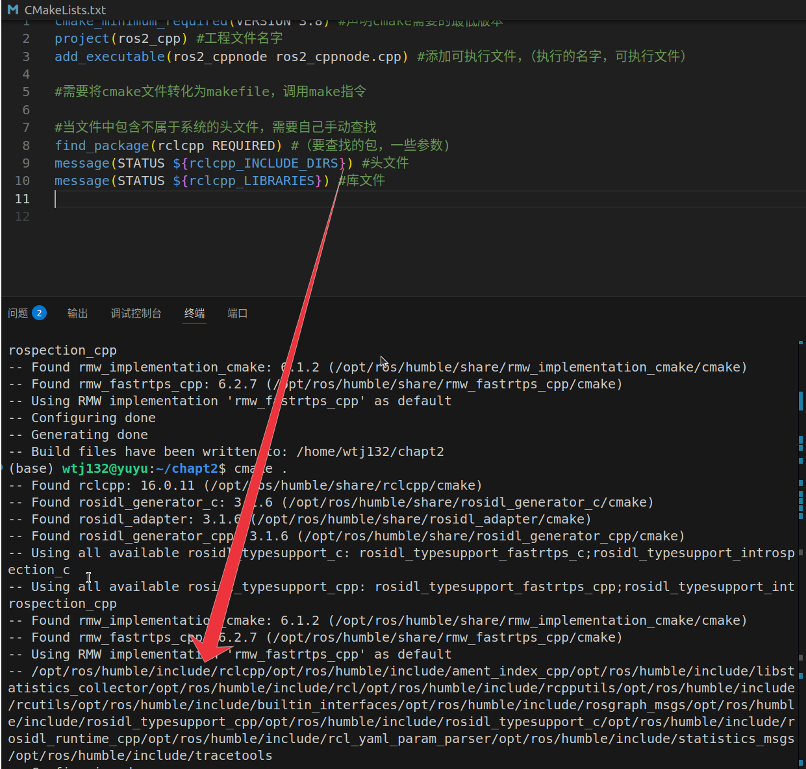
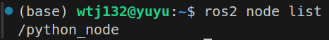
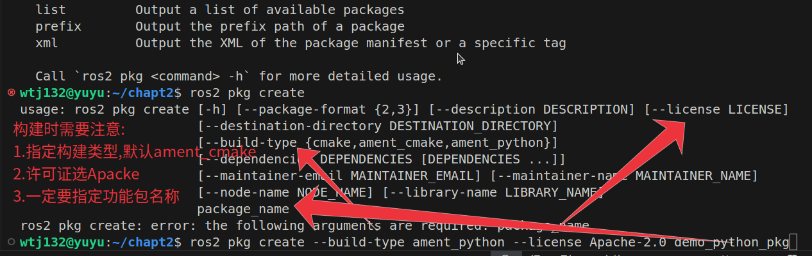

# 第一章 基础

## c++代码运行过程



## cmake

如何添加不是程序自带的库文件



```txt
cmake_minimum_required(VERSION 3.8) #声明cmake需要的最低版本
project(ros2_cpp) #工程文件名字
add_executable(ros2_cppnode ros2_cppnode.cpp) #添加可执行文件，（执行的名字，可执行文件）

#需要将cmake文件转化为makefile，调用make指令

#当文件中包含不属于系统的头文件，需要自己手动查找
find_package(rclcpp REQUIRED) #（要查找的包，一些参数)
message(STATUS ${rclcpp_INCLUDE_DIRS}) #头文件以及rclcpp依赖的头文件
message(STATUS ${rclcpp_LIBRARIES}) #库文件

target_include_directories(ros2_cppnode PUBLIC ${rclcpp_INCLUDE_DIRS}) #头文件包含
target_link_libraries(ros2_cppnode ${rclcpp_LIBRARIES}) #库文件链接
```


# 第二章 节点

##python

###编写第一个节点(python)

```python
import rclpy
from rclpy.node import Node

def main():
    rclpy.init()
    node = Node("python_node")
    node.get_logger("你好")
    rclpy.spin(node)
    rclpy.shutdown()

if __name__=="__main__":
    main()

```

要点，在运行后，可以通过在终端中运行`ros2 node list`来查看当前运行的节点，显示的名字就是Node（“”）中的名字



小tips: ctrl+shift+5快速创建一个新的终端


`node.get_logger().info("message")或node.get_logger().warn("message")`在终端中进行输出，日志记录


### 使用功能包组织python节点

 

>\# 在ros2的功能包中会自动调用main函数执行文件
>
>\# 但需要在setup文件中声明需要调用的函数在哪里
>
>\# 要将需要的库的声明加入到package.xml文件中

colcon命令

colcon.build 命令构建功能包,新创建三个文件夹:build,install,log

build:中间文件

install:结果文件


## cpp

###编写第一个节点(cpp)

```cpp
#include"iostream"
#include"rclcpp/rclcpp.hpp"
using namespace std;
int main(int argc,char** argv){
    rclcpp::init(argc,argv);
    auto node = make_shared<rclcpp::Node>("cpp_node"); //make_shared 智能指针
    RCLCPP_INFO(node->get_logger(),"节点");
    rclcpp::spin(node);
    rclcpp::shutdown();
    return 0;
}
```

需要额外构筑cmakelist

```txt
cmake_minimum_required(VERSION 3.8) #声明cmake需要的最低版本
project(ros2_cpp) #工程文件名字
add_executable(ros2_cppnode ros2_cppnode.cpp) #添加可执行文件，（执行的名字，可执行文件）

#需要将cmake文件转化为makefile，调用make指令

#当文件中包含不属于系统的头文件，需要自己手动查找
find_package(rclcpp REQUIRED) #（要查找的包，一些参数)
message(STATUS ${rclcpp_INCLUDE_DIRS}) #头文件以及rclcpp依赖的头文件
message(STATUS ${rclcpp_LIBRARIES}) #库文件

target_include_directories(ros2_cppnode PUBLIC ${rclcpp_INCLUDE_DIRS}) #头文件包含
target_link_libraries(ros2_cppnode ${rclcpp_LIBRARIES}) #库文件链接
```

> cmake运行过程，在终端运行cmake .再运行make构建makefile，最后通过./name运行可执行文件,产生输出

> tips:
>
> 1.使用ros2 node list查看在运行的节点
>
> 2.使用ros2 node info /name 查看具体节点信息
>
> 
