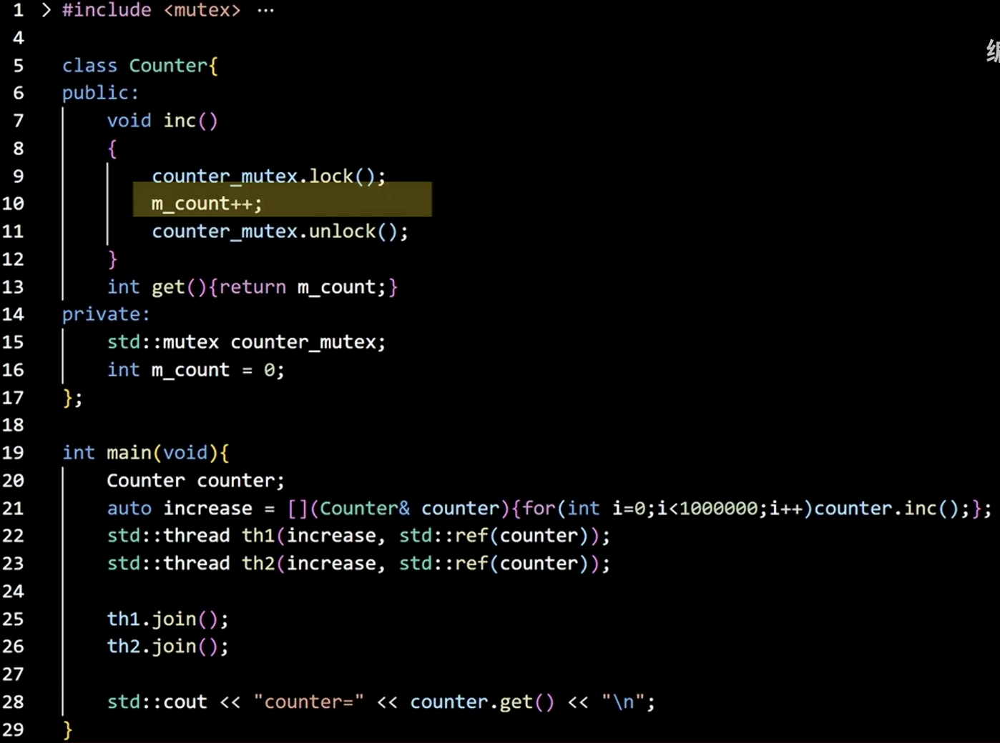
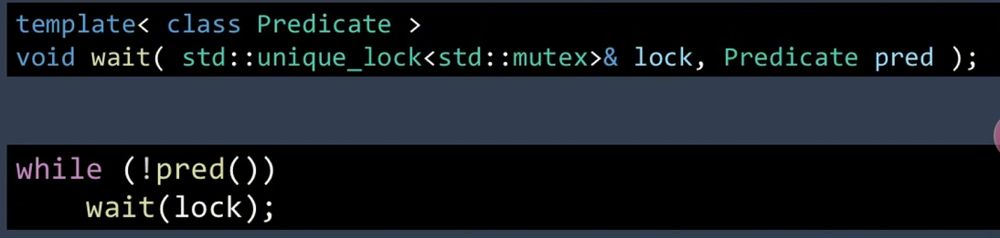

# 数据结构和算法

***三个强查找数据结构：***

*红黑树、B树，哈希*

## 红黑树

==定义，旋转，插入，删除==

- 性质


此处的叶子节点为nil节点，而不是没有子节点的节点

- 旋转

  > 当红黑树的结构发生冲突，进行旋转，旋转不影响红黑树其他性质
  >
  > 
  >
  > 当两个节点x，y进行旋转
  >
  > 左旋：
  >
  > ​			x代替y的左子树，y原本的左子树变成x的右子树
  >
  > 右旋：
  >
  > ​			y替换x的右子树，x原本的右子树变成y的左子树
  >
  > 左旋：
  >
  > ```cpp
  > //tree节点用来判断是不是根节点和叶结点,x是轴心节点
  > void rbtree_left_rotate(rbtree *T,rbtree_node *x){
  >     //左旋和右旋都改变3个指向
  >     rbtree_node *y = x->right;
  >     x->right = y->left;
  >     if(y->left != T->nil) y->left->parent = x;
  >     y->parent = x->parent;
  >     if(x->parent == T->nil){
  >         T->root = y;
  >     }
  >     //如果x不是根节点，需要判断x原来是左节点还是右节点
  >     else if(x == x->parent->left) {
  >         x->parent->left = y;
  >     }else{
  >         x->parent->right = y;
  >     }
  >     //第3对
  >     y->left = x;
  >     x->parent = y;
  > } //完成左旋只需要一个树节点和x节点（轴心节点)
  > ```

- 插入

  > 插入流程，插入的value与当前节点value对比，比当前节点大，与当前节点的右节点对比，小，与左节点对比，直到抵达叶节点
  >
  > 红黑树插入的问题
  >
  > 红黑树在插入任何节点前就已经是一个红黑树了
  >
  > ​	1.归纳
  >
  > ​		
  >
  > ​	2.叔节点是红色（以下均建立在父节点是红色的基础上，且父节点是祖节点的左节点）
  >
  > ​	
  >
  > ​	3.叔节点是黑色的
  >
  > 针对	
  >
  > 针对当前节点的祖节点进行右旋
  >
  > 


```cpp
#include <iostream>
using namespace std;

#define RBTREE_ENTRY(name,type)\
    struct name{\
        struct type *left;\
        struct type *right;\
        struct type *parent;\
        unsigned char color;\
    }\

typedef struct _rbtree_node {
    int key;
    void *value;
#if 1
    _rbtree_node *parent;
    _rbtree_node *left;
    _rbtree_node *right;
    unsigned char color;
#else
    RBTREE_ENTRY(,_rbtree_node) node;
#endif
} rbtree_node;

typedef struct _rbtree {
    rbtree_node *root;
    rbtree_node *nil; //所有叶节点指向nil
}rbtree;

//tree节点用来判断是不是根节点和叶结点,x是轴心节点
void rbtree_left_rotate(rbtree *T,rbtree_node *x){
    //左旋和右旋都改变3个指向
    rbtree_node *y = x->right;
    x->right = y->left;
    if(y->left != T->nil) y->left->parent = x;
    y->parent = x->parent;
    if(x->parent == T->nil){
        T->root = y;
    }
    //如果x不是根节点，需要判断x原来是左节点还是右节点
    else if(x == x->parent->left) {
        x->parent->left = y;
    }else{
        x->parent->right = y;
    }
    //第3对
    y->left = x;
    x->parent = y;
} //完成左旋只需要一个树节点和x节点（轴心节点）

void rbtree_right_rotate(rbtree *T,rbtree_node *y){
    //左旋和右旋都改变3个指向
    rbtree_node *x = y->right;
    y->left = x->right;
    if(x->right != T->nil) x->right->parent = y;
    x->parent = y->parent;
    if(y->parent == T->nil){
        T->root = x;
    }
    //如果x不是根节点，需要判断x原来是左节点还是右节点
    else if(y == y->parent->left) {
        y->parent->left = x;
    }else{
        y->parent->right = x;
    }
    //第3对
    x->right = y;
    y->parent = x;
} //完成右旋只需要一个树节点和x节点（轴心节点）

//红黑树插入修正,如果父节点是红色，就只能是黑色，但如果影响了性质5，就需要旋转
//默认z为红色
void rbtree_insert_fixup(rbtree *T,rbtree_node *z) {
    while (z->parent->color == 'r') {//此时z是红色，z的父节点也为红色，z的祖父节点一定是黑色
        //此时针对z的叔父节点进行分类判断
        //先判断z的父节点是祖节点的左还是右
        if (z->parent == z->parent->parent->left) {
            rbtree_node *y = z->parent->parent->right; //y是祖父节点的右节点
            if (y->color == 'r') { //如果y是红色，则不存在子节点
                z->parent->color = 'b';
                y->color = 'b';
                z->parent->parent->color = 'r';

                z = z->parent->parent; //在回溯的过程中，始终保持z是红色的，此时的z并不是插入的z
            }else {//叔节点是黑色，将z的父节点改为黑色，祖节点改为红色，以祖节点为轴心进行右旋
                if (z == z->parent->right) {
                    //z是左孩子，第3步
                    z = z->parent;
                    rbtree_left_rotate(T,z);
                    }
                    z->parent->color = 'b';
                    z->parent->parent->color = 'r';
                    z = z->parent->parent;

                    rbtree_right_rotate(T,z);

                }
            }
        }
    }
//插入也只需要两个节点，根节点和插入节点
void insert(rbtree *T,rbtree_node *z) {
    rbtree_node *x = T->root;
    rbtree_node *p = T->nil;
    while (x != T->nil) {
        p = x;
        if (z->key < x->key) {
            x = x->left;
        }else if (z->key > x->key) {
            x = x->right;
        }else {//当前节点已经存在，丢弃或改变key，具体根据需求决定
            return;
        }
    }
    if (p == T->nil) {
        T->root = z;
    }
    else if (z->key>p->key) {
        p->right = z;
    }else {
        p->left = z;
    }
    z->parent = p;
    //新插入节点，左右均为叶子节点
    z->left = T->nil;
    z->right = T->nil;
    //上色问题，父节点是黑色，直接插入，父节点是红色，进行调整
    
}
```


## B树和B+树

- 性质

  

磁盘上的任意一块区域都可以由轨道和扇区进行描述,成为块

在读取数据时，只需要知道轨道号、扇区号和偏移量

研究在主存储中如何更有效的读写数据，成为数据结构，而研究如何在磁盘上更有效的进行读写数据，称为DBMS


索引表的建立对于磁盘的IO更加有效 

对密集索引可以引入稀疏索引，可以进一步缩小访问的块的数量（多级索引）


为了实现多级索引的自主添加和删除，使用B和B+树

m叉树，每个节点的key值可以不只1个，子节点也不只2个


 cp是子节点地址，rp是记录节点地址


m叉树的创建过程不受约束，在创建m树是加上一些创建规则，就构成了B树

1.只有当节点的子节点数量大于m/2时才能创建下一个节点

2.根节点可以只有2个子节点

3.所有的叶节点在同一个水平

4.


当节点中key值满溢时，中间节点向上裂变。因此，B树是由下向上生长的，每当引入一个新的key值，找到位置，如果当前key值容量满溢，向上裂变，如果上层的key同样满溢，继续向上裂变


B+树与B树的区别

B+树中只有叶节点记录rp（record point）即指向具体信息的指针，叶子节点存储数据，内节点作为索引用，所有上层的key值在叶节点中均有copy


B树删除

1.合并

2.借位

> 借位只能从父节点借
>
> 当子树中的key值数量等于m/2-1，为了防止后续资源不足，需要进行借位
>
> 当不能借位（父节点和兄弟节点key值数量不足）--》合并

先通过合并或借位形成一个可以删除的B树在进行删除

删除叶子节点：


合并


删除内节点：

​	先将内节点合并到叶子节点进行删除 


- 分裂(内节点和叶节点)

  

  ```cpp
  #include <cstdlib>
  int M = 6;
  typedef struct _btree_node {
      int *keys;
      _btree_node **children;
  
      int num;
      int leaf;
  }btree_node;
  
  typedef struct _btree {
      btree_node *root;
  }btree;
  //创建新节点，需要判断是不是叶子节点
  btree_node *btree_create_node(int leaf) {
      btree_node *node = (btree_node *)calloc(1,sizeof(btree_node));
      if (node == NULL) {return nullptr;}
      node->leaf = leaf; //是不是叶子节点
      node->keys = (int *)(calloc(2 * M - 1, sizeof(int)));
      node->num = 0; //有几个key值
  
      return node;
  }
  //删除节点
  void btree_destory_node(btree_node *node) {
      free(node->keys);
      free(node->children);
      free(node);
  }
  //分裂,T为根节点，x为待分裂节点的父节点，i为待分裂节点是x的第几颗子树
  void btree_split_children(btree *T,btree_node *x,int k) {
      btree_node *y = x->children[k]; //y为待分裂节点所在的子树
      btree_node *z = btree_create_node(y->leaf); //创建一个新节点，用来存放y中后几个key值
  
      //对z进行赋值
      z->num = M-1;
      for (int j = 0;j<M-1;j++) {
          z->keys[j] = y->keys[M+j]; //z中的key值是y中从M开始的后i个key值（M-》2M-1）
      }
  
      if (y->leaf == 0) { //y不是叶子节点，需要对子节点进行处理
          for (int i = 0;i<M;i++) {
              z->children[i] = y->children[M+i]; //z的子节点同样是y的[M,2M-1]个子节点
          }
      }
      y->num = M;
  
      //到这一步，分裂完成了，现在向上裂变，如果t(向上满溢的节点)是放到x中间部分，还需要额外判断
      for (int i = x->num;i >= k+1;i--) {
          x->children[i+1] = x->children[i]; //所有在k(t插入后的位置)以后的key的子树向后移动一位，为t空出位置
      }
      x->children[k+1] = z;
      //对children执行完后，对key执行移动
      for (int i = x->num-1;i>=k;i--) {
          x->keys[i+1] = x->keys[i];
      }
      x->keys[k+1] = y->keys[M];
      x->num++;
  
  }
  ```

- 根节点分裂会一分为3

  

  


## 哈希


### 散列表

离散化，存储key与存储位置的映射关系

组成：

​	哈希函数

>选择依据：
>
>​	计算速度快，强随机
>
>常用哈希函数：
>
>​	murmurhash2，siphash，cityhash
>
>插入：
>
>​	value(key)%size -->获取存储位置
>
>删除：
>
>**冲突** ：会出现哈希冲突，插入位置重复
>
>​	通过负载因子（存储个数/数组长度）描述充足的激烈程度
>
>​	==负载因子在合理范围内（0-1）==
>
>​	链表法处理冲突（常用）
>
>​	开放寻址法：在检索冲突的位置＋1继续向后查找，存储同理，直到找到空余为止（该方法会产生同类哈希聚集的问题）
>
>​	双重哈希解决哈希聚集：
>
>​	
>
>负载因子不合理(<0.1 || >1)：
>
>​	扩容
>
>​	缩容	
>
>​	rehash

​	数组

散列表：

​	传统实现：


​	unordered四兄弟的底层实现都是散列表 

​	改进，将所有链表穿到一起：


注意，这里每个节点（key）中存储的hash_node是上一个节点，方便插入时使用头插法，eg，4中存的node->next->value才是4确实对应的value

---


### 布隆过滤器

使用场景：

​	内存有限，目的不是找到key对应的value，而只想知道当前key是不是存在

​	文件中是否有key

​	数据库


构成：

​	使用位图（vector<char>)来实现，相当于一个数组，但值只有0,1

​	使用n个hash函数

​	位图：


<center>布隆过滤器原理图</center>

​	

存储：每个str通过3个哈希函数，会获得3个位置，在位图中将这3个位置置为1

搜索：经过3个哈希函数后如果有为0的，不存在

​	如果都为1，也不一定存在，但这种不确定性可以控制

删除：==不支持删除==

可以确定某个key一定不存在，即如果布隆过滤器输出为否，则一定不存在


<center>布隆过滤器的应用：</center>


k = 31时假阳率最低


哈希函数的选择：

​	如何选择k个哈希函数


​	

<center>使用</center>

1.输入存储的数据量和期望的假阳率，调用api计算位图大小和哈希函数个数

2.插入

3.查询


### 分布式一致性哈希

解决分布式缓存问题

缓存失效问题

> 存储和访问所得到的查询不同

​	固定算法，将被取余数固定，改变映射关系， 


哈希迁移：在新增节点的时候，将下个节点中的key值进行转移

哈希偏移：节点密集

​	通过增加虚拟节点，可以解决哈希偏移和哈希迁移的问题


**避免内存失效**：

​	固定算法，数据迁移

**保证数据均衡**：

​	虚拟节点


# C++新特性

## 智能指针

==自动释放，防止内存泄漏==


- unique_ptr

  


## C++线程与协程

### 线程

<center>线程</center>

​	线程是一个进程中程序执行过程，分配栈和线程控制块，线程间共享堆数据，每个线程都有自己的栈数据

线程的创建：

​	使用thread类创建线程

<center>`thread(F&& f,Args&&...args)`</center>

f为线程要执行的函数，称为线程函数，args是传递给成员函数的实参（f不为类的非静态成员函数）

否则，args中的第一个值为f的类对象地址，剩余为实参

==在传引用参数时，需要加上std::ref()函数==

```cpp

//
// Created by 王天 on 2025/4/15.
//
#include "funcs.h"

#include<iostream>
//函数
void myfunc(int num1,int num2,int& res) {
    res=num1+num2;
}
//类成员函数，仿函数

void myfunctor::operator()(int num1,int num2) {
    res = num1+num2;
}
//类

void Myclass::sum(int num1,int num2) {
    res = num1 + num2;
}

int main() {
    int a = 1;
    int b = 2;
    int res = 0;
  //在传引用参数时，需要加上std::ref()函数
    thread thread1(myfunc,a,b,ref(res));

    myfunctor f;
    thread thread2(f,a,b);

    Myclass obj;
    thread thread3(&Myclass::sum,&obj,a,b);

    thread1.join();
    thread2.join();
    thread3.join();

    cout << res << endl;
    cout<<f.res<<endl;
    cout<<obj.res<<endl;

    /*
    * 3
    * 0
    * 3
     */
}
```

​	当创建了一个线程后，需要等待线程执行完毕才可以结束主线程，可以调用mythread.join()函数实现。

​	在调用join()函数时，该线程一定是可合并的`mythread.joinable()`来判断

以下线程函数不能合并：


​	cout没有针对多线程进行处理，因此在多线程中会输出混乱的效果，可以使用printf代替


---

1.线程中的常用操作

`thread thread1(f,a,b)`

​	1.detach()

> 脱离，当执行了thread1.detach()后，主进程无法再影响线程1
>
> 此时thread1.get_id()函数报错

​	2.get_id()

> 返回线程的索引

​	3.joinable()

> 判断线程是否是可合并的，返回bool值

​	4.move()

> 将当前线程所有权转到另一个线程中
>
> `t6_2(std::move(t6_1))`
>
> `t6_1` 报异常 

---


eg.使用array容纳10个线程


	

一个并行计算的例子：


部分1：transform_reduce函数模板， 对一个容器从first到last范围内，使用transfrom函数进行变换，并将结果由reduce函数累计计算到引用参数res中


主函数部分：首先定义两个lambda函数，transform和reduce，计算平方和 


分支部分：


合并：


​	进一步，采用分治的方法，将任务一次次细分到不能分为止,可以尽可能利用cpu资源


---


<h3 align = "center">2.promise/future</h3>

###2.promise/future

---


补充：

**promise和future**

[多线程promise和future](https://www.bilibili.com/video/BV19tC3YvEAd?spm_id_from=333.788.player.switch&vd_source=320b05d266477bf0023a916c09255911)

实现功能：线程间通信，通过shared state进行通信


promise类:

>   ​	`std::promise` 同样是 `<future>` 头文件中的模板类。它可以用来设置一个值或异常，这个值或异常会在未来被 `std::future` 对象获取。`std::promise` 与 `std::future` 是紧密关联的，`std::promise` 对象可以通过 `get_future()` 方法返回一个与之关联的 `std::future` 对象，之后可以通过 `set_value()` 方法设置要传递的值，或者通过 `set_exception()` 方法设置异常。

future:

>   ​	代表一个异步操作的结果。当你启动一个异步任务时，会得到一个 `std::future` 对象，该对象可以在未来某个时刻获取异步操作的返回值。`std::future` 对象提供了一种机制，让你可以查询异步操作是否已经完成，或者阻塞当前线程直到异步操作完成并获取其结果。

常用：

1.promise()

创建一个shared state对象，使用智能指针shared ptr来封装

2.promise(promise&& x)


3.get_future

创建future对象，使用promise对象中的共享状态对象作为初始化参数创建future对象，future对象：

>   ​	由于 `std::future` 只能与一个对象关联，所以它==是不可复制的==。复制 `std::future` 对象会导致多个对象关联同一个异步操作结果，违反了上述设计原则。因此，`std::future` 只支持移动语义，即可以==通过 `std::move()` 函数将一个 `std::future` 对象的所有权转移给另一个 `std::future` 对象。==此外，也可以通过引用的方式传递 `std::future` 对象，因为引用只是对象的别名，不会复制对象本身。
>
>   ​	复制相当于多了一份，移动相当于只有一份，只是手把手传递

4.set_value


5.set_exception


例子：


改进：


右值引用：

移动构造函数

move()->将左值转为右值

```cpp
#include <iostream>
#include <vector>

class MyVector {
public:
    // 构造函数
    MyVector(size_t size) : data(new int[size]), size(size) {
        std::cout << "Constructor" << std::endl;
    }

    // 拷贝构造函数
    MyVector(const MyVector& other) : size(other.size) {
        data = new int[size];
        for (size_t i = 0; i < size; ++i) {
            data[i] = other.data[i];
        }
        std::cout << "Copy Constructor" << std::endl;
    }

    // 移动构造函数
    MyVector(MyVector&& other) noexcept : data(other.data), size(other.size) {
        other.data = nullptr;
        other.size = 0;
        std::cout << "Move Constructor" << std::endl;
    }

    // 析构函数
    ~MyVector() {
        delete[] data;
    }

private:
    int* data;
    size_t size;
};

int main() {
    MyVector v1(1000);
    MyVector v2(std::move(v1)); // 使用 std::move 将左值转换为右值，调用移动构造函数
    return 0;
}
```

<center>shared_future</center>


---


<h3 align = "center">3.互斥量</h3>

### 3.互斥量


当多线程在同一时间对同一数据对象进行写入\或一个写入，一个读取，会发生数据竞争。

但多个线程同时读取同一个数据对象时不会发生数据竞争 。


互斥量Mutex

<center>std::mutex</center>

---


1.lock

​	lock用于获得这个互斥量，如果该互斥量已经被锁定，进入阻塞状态

2.try_lock

​	返回bool值，但即使返回false值，也不保证该数据正被其他线程锁定

3.unlock

---




被保护的代码称为临界区，访问共享区域，例如内存或文件


---


​	mutex单独使用时，如果函数返回抛出异常，容易出现未释放互斥量，对此，结合以下三个使用

4.lock_guard

> ​	`std::lock_guard` 的主要作用是简化互斥锁的使用，避免手动管理锁的加锁和解锁操作，从而减少因忘记解锁而导致的死锁风险。当 `std::lock_guard` 对象被创建时，它会自动对传入的互斥锁进行加锁操作；当 `std::lock_guard` 对象的生命周期结束时（例如离开其作用域），它会自动对互斥锁进行解锁操作。


```cpp
#include <iostream>
#include <thread>
#include <mutex>
#include <vector>

// 定义一个互斥锁
std::mutex mtx;
// 共享资源
int shared_variable = 0;

// 线程函数，对共享资源进行递增操作
void increment() {
    for (int i = 0; i < 100000; ++i) {
        // 创建一个 std::lock_guard 对象，自动加锁
        std::lock_guard<std::mutex> lock(mtx);
        // 对共享资源进行操作
        ++shared_variable;
        // 离开作用域，std::lock_guard 对象析构，自动解锁
    }
}

int main() {
    // 创建两个线程
    std::vector<std::thread> threads;
    threads.emplace_back(increment);
    threads.emplace_back(increment);

    // 等待两个线程执行完毕
    for (auto& thread : threads) {
        thread.join();
    }

    // 输出最终结果
    std::cout << "Final value of shared_variable: " << shared_variable << std::endl;

    return 0;
}
```

==不能被拷贝==

5.unique_lock(常用)

> 和 `std::lock_guard` 类似，它能够自动管理互斥锁的加锁和解锁操作，但 `std::unique_lock` 更加灵活。
>
> **特性**
>
> 1.灵活
>
> ​	`std::unique_lock` 可以在构造时不立即加锁，也能在对象生命周期内随时加锁和解锁，这一点和 `std::lock_guard` 不同，`std::lock_guard` 一旦构造就会立即加锁，且在析构时才解锁。
>
> 2.可移动
>
> ​	`std::unique_lock` 支持移动语义，可以把锁的所有权从一个 `std::unique_lock` 对象转移到另一个对象，这在某些场景下很有用，比如在函数之间传递锁。
>
> 3.配合条件变量
>
> ​	`std::unique_lock` 常和条件变量（如 `std::condition_variable`）一起使用，因为条件变量的 `wait` 方法需要一个可以解锁和重新加锁的锁，`std::unique_lock` 正好满足这个要求。


6.scoped_lock

---


<center>多线程死锁</center>

例子：

在普通的 `std::mutex` 中，如果同一个线程对其进行多次加锁，而没有相应次数的解锁操作，就会导致死锁，因为第二次加锁时会发现锁已经被占用，从而阻塞当前线程，而该线程又因为需要解锁才能继续执行，这样就形成了死循环。	

 简单的解决方法：将mutex换成recursive_mutex 

recursive_mutex:

> 和普通的 `std::mutex` 不同，`std::recursive_mutex` 允许同一个线程对其进行多次加锁操作，而不会产生死锁。
>
> ---
>
> 特性：
>
> **可重入性**：
>
> ​	这是 `std::recursive_mutex` 最主要的特性。同一个线程可以对 `std::recursive_mutex` 进行多次加锁，每次加锁操作都会增加锁的引用计数，相应地，每次解锁操作会减少引用计数。只有当引用计数为 0 时，锁才会真正被释放，其他线程才能获取该锁。
>
> **互斥性**：
>
> ​	和普通的互斥锁一样，`std::recursive_mutex` 也保证了在同一时间只有一个线程可以访问被保护的共享资源。当一个线程持有 `std::recursive_mutex` 时，其他线程试图获取该锁会被阻塞，直到持有锁的线程释放该锁。


活锁


使用std::lock函数或std::scoped_lock类管理多个锁

**Std::lock核心思想**

任何一个线程在等待获得资源的时候不能锁定任何资源，如果已经获得资源，释放


---

<center>读写锁</center>

==待补充==


---


<h3 align = "center">4.条件变量</h3>

###4.条件变量

<center>Condition_variable</center>


1.等待

a.wait


在进入wait函数后，wait会释放这个互斥量，并进入阻塞状态，直到另一个线程调用notify函数，wait会再次获得这个互斥量

```cpp
#include <iostream>
#include <algorithm>
#include <math.h>
#include <vector>
#include <string>
#include <queue>
#include <set>
#include <unordered_set>
#include <array>
#include<map>
#include <unordered_map>
#include <thread>
#include <mutex>
#include <condition_variable>
#include <sstream>
#include <chrono>

using namespace std;

class Channel{
public:
    void getdata(){
        auto tid = std::this_thread::get_id();
        std::unique_lock<std::mutex> lck(mutex_); //对sharedData上锁
        std::cout<<"接收方["<<tid<<"]等待数据"<<endl;
        condVar.wait(lck);//如果条件不满足，对sharedData解锁，进入阻塞状态，直到唤醒，重新上锁，继续执行
        std::cout<<"接收方["<<tid<<"]接收数据"<<endl;
        sharedData.clear();
    }
    void setdata(){
        static int id = 1;
        std::stringstream ss;
        ss<<"hello #"<<id;
        {
            std::unique_lock<std::mutex> lck(mutex_);
            sharedData = ss.str();
            std::cout<<"\n发送方：#"<<id<<"条数据写入完成"<<std::endl;
            id++;
        }
        condVar.notify_one();
        std::this_thread::sleep_for(std::chrono::milliseconds(1));
    }


private:
    std::mutex mutex_;
    std::condition_variable condVar;
    string sharedData;
};

int main(){
    Channel channel1;
    std::thread write_th(&Channel::setdata,&channel1);
    std::thread read_th(&Channel::getdata,&channel1);

    write_th.join();
    read_th.join();

}
```



可以避免丢失唤醒和虚假唤醒的发生

b.wait_for


c.wait_until


2.通知

a.notify_one


b.notify_all


### 5.异步任务

---

​	将函数交由另一个线程执行，当前线程继续执行，直到需要调用函数结果时再去调用异步线程中的函数结果


<center>std::async</center>

​	`std::async` 位于 `<future>` 头文件中，用于异步执行任务。

​	`std::async` 可以用来启动一个异步任务，它会返回一个 `std::future` 对象，通过这个对象可以在未来某个时刻获取异步任务的结果。异步任务可以在新线程中执行，也可以在当前线程中延迟执行，具体取决于传递给 `std::async` 的启动策略。

>   ---
>
>   <center>模板</center>
>
>   ```cpp
>   template< class Function, class... Args >
>   std::future<std::invoke_result_t<std::decay_t<Function>, std::decay_t<Args>...>>
>       async( std::launch policy, Function&& f, Args&&... args );
>   
>   
>   template< class Function, class... Args >
>   std::future<std::invoke_result_t<std::decay_t<Function>, std::decay_t<Args>...>>
>       async( Function&& f, Args&&... args );
>   ```
>
>   ---
>
>   
>
>   <center>policy</center>
>
>   启动策略:
>
>   ​	是一个std::launch类型的枚举值，有以下两种常用取值：
>
>   -   `std::launch::async`：异步执行，会立即创建一个新线程来执行任务。
>   -   `std::launch::deferred`：延迟执行，任务会在调用 `std::future` 的 `get()` 或 `wait()` 方法时在当前线程中执行。
>   -   如果不指定 `policy`，则默认使用 `std::launch::async | std::launch::deferred`，这意味着具体的执行策略由实现决定。
>
>   <center>f</center>
>
>   ​	要执行的可调用对象，如函数、函数指针、成员函数指针、lambda 表达式等。


cpp知识点：

- 宏

  > 在 C 和 C++ 里，`#define` 是预处理指令，用于定义宏。宏其实就是一种文本替换机制，在编译代码之前，预处理器会把代码里所有使用宏的地方替换成宏定义的内容。
  >
  > ```cpp
  > //宏
  > #define RBTREE_ENTRY(name,type)\
  >     struct name{               \
  >     struct type *right;\
  >     struct type *left;\
  >     struct type *parent;       \
  >     unsigned char color;       \
  >     };
  > ```
  >
  > 使用示例：
  >
  > ```cpp
  > int main(){
  >     
  >     RBTREE_ENTRY(node,_rbtree_node);
  >     /*
  >     struct node{
  >     	struct _rbtree_node *right;
  >     	struct _rbtree_node *left;
  >     	struct _rbtree_node *parent;
  >     	unsigned char color;
  >     }
  >     */
  >     node* n = new node();
  >     n->color = 'b';
  >     std::cout<<n->color<<std::endl;
  > }
  > ```


