# day1

## 基础概念

1.协议

事先定好的传输解释规则


2.OSI七层模型

3.TCP/IP四层模型

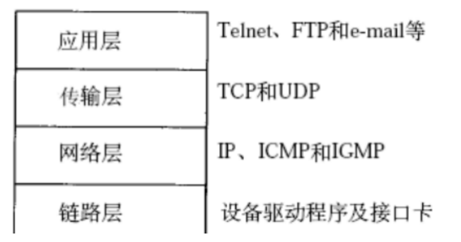

4.数据通信过程

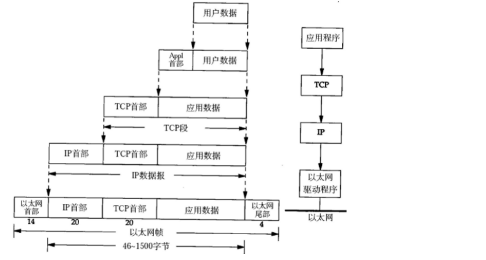


5.设计模式

5.1 CS设计模式

> ​	传统的网络应用设计模式，客户机(client)/服务器(server)模式。需要在通讯两端各自部署客户机和服务器来完成数据通信。
>
> ftp协议

5.2 BS设计模式

> 浏览器(broswer)/服务器(server)模式。只需在一端部署服务器，而另外一端使用每台PC都默认配置的浏览器即可完成数据的传输。
>
> http协议


6.常用协议

6.1 以太网帧

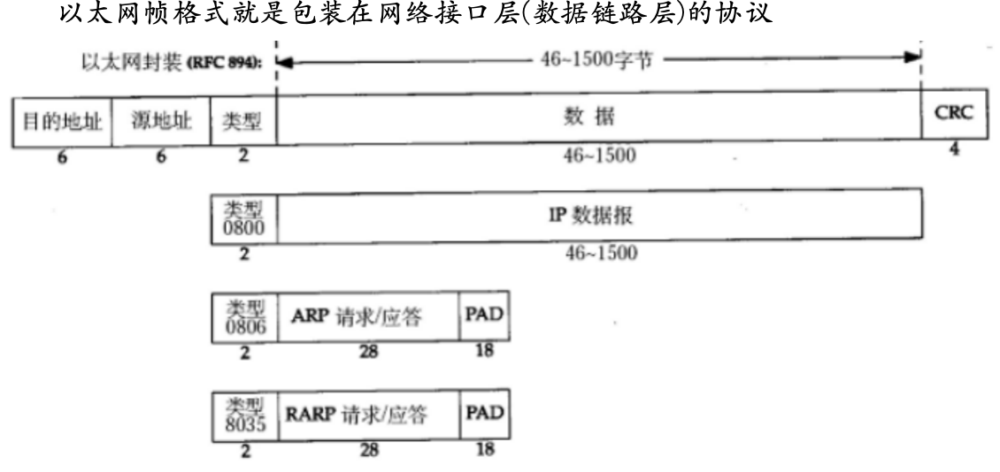

目的地址=硬件地址=mac地址，使用ifconfig访问

源地址=硬件地址，信息发出


CRC校验


例子：ARP请求

> ARP请求为了确认目的地址，当前发送端只知道目的端的ip地址，因此通过发送端发送ARP广播, 接收到该ARP数据的主机先判断是否是自己的IP, 若是则应答一个ARP应答报文, 并将mac地址填入应答报文中; 

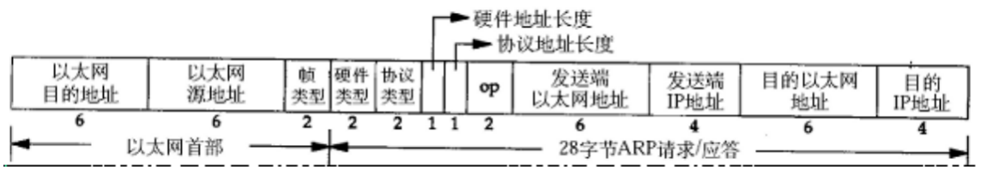


6.2 IP协议

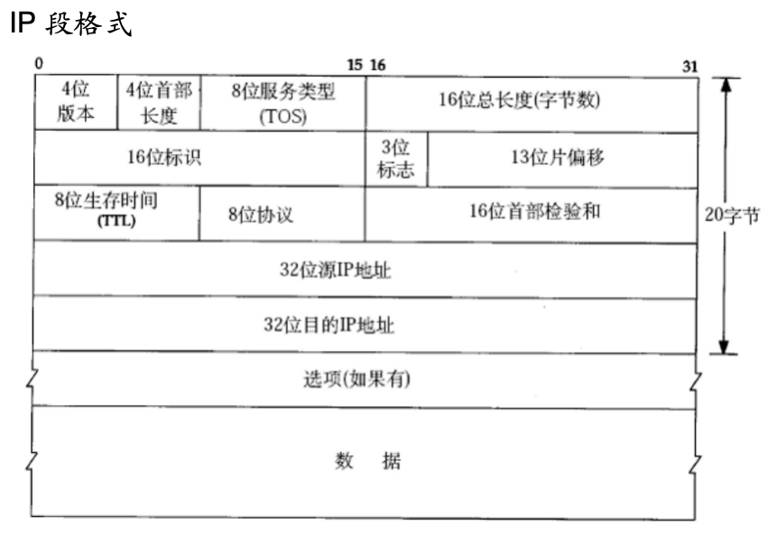

==8位生存时间ttl(网络连接下一跳的次数): 为了防止网络阻塞==


6.3 UDP协议

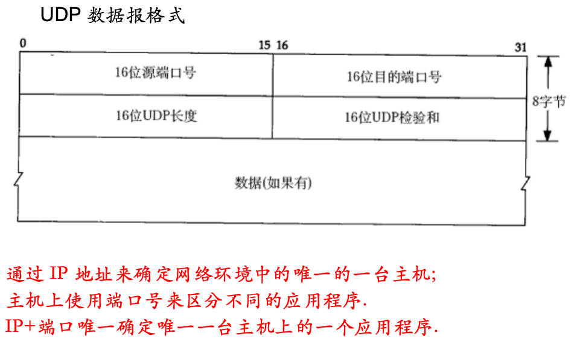


端口：

> - 服务器相当于 “一栋大楼”（IP 地址是大楼的门牌号），
> - 端口相当于 “大楼内的不同房间”（每个房间对应一个服务，如 80 号房间是 Web 服务，21 号房间是 FTP 服务）。
>   当客户端发送请求时，需同时指定 “大楼地址”（IP）和 “房间号”（端口），才能准确找到目标服务。
> - 通过


6.4 TCP协议

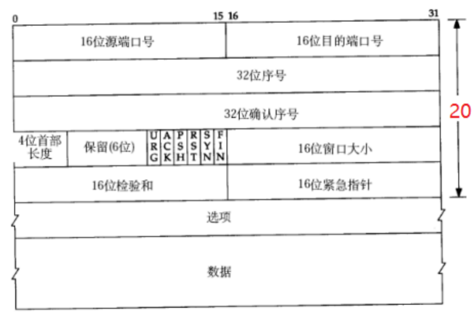

==32位序号和32位确认序号==

​	如何将大文件拼接起来(序号)，确认是否收到数据(确认序号)

==ACK、SYN、FIN==

​	SYN建立连接，FIN结束连接

16位窗口大小

​	防止发送过快导致信息丢失

---


## 二.SOCKET编程

> socket会建立一个文件描述符，操作两个缓冲区
>
> 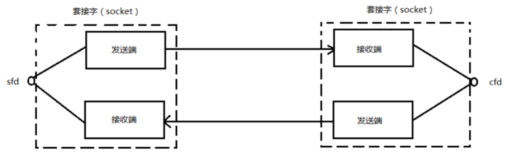

---


1.关键api

==int socket(int domain, int type, int protocol);==

> domain: 协议版本
>
> ​	AF_INET IPV4
>
> ​	AF_INET6 IPV6
>
> ​	AF_UNIX AF_LOCAL本地套接字使用
>
> type:协议类型
>
> ​	SOCK_STREAM 流式, 默认使用的协议是TCP协议
>
> ​	SOCK_DGRAM  报式, 默认使用的是UDP协议
>
> protocal: 
>
> ​	一般填0, 表示使用对应类型的默认协议.
>
> 返回值: 
>
> ​	成功: 返回一个大于0的文件描述符
>
> ​	失败: 返回-1, 并设置errno


==int bind(int sockfd, const struct sockaddr *addr, socklen_t addrlen);==

​	将socket文件描述符和IP,PORT绑定

> 参数说明:
>
> ​	socket: 调用socket函数返回的文件描述符
>
> ​	addr: 本地服务器的IP地址和PORT, 
>
> ​	struct sockaddr_in serv;
>
> ​	serv.sin_family = AF_INET;
>
> ​	serv.sin_port = htons(8888);
>
> ​	//serv.sin_addr.s_addr = htonl(INADDR_ANY);
>
> ​	//INADDR_ANY: 表示使用本机任意有效的可用IP
>
>  	如果要自己指定地址：
>
> ​	inet_pton(AF_INET, "127.0.0.1", &serv.sin_addr.s_addr);
>
> ​	addrlen: addr变量的占用的内存大小 
>
> 返回值: 
>
> ​	成功: 返回0
>
> ​	失败: 返回-1, 并设置errno


==int listen(int sockfd, int backlog);==

​	将套接字由主动态变为被动态


==int accept(int sockfd, struct sockaddr *addr, socklen_t *addrlen);==

​	获得一个连接, 若当前没有连接则会阻塞等待.

​	文件描述符有两种，在调用listen后，为监听文件描述符和用于通信的文件描述符

> 函数参数:
>
> ​	sockfd: 调用socket函数返回的文件描述符
>
> ​	addr: 传出参数, 保存客户端的地址信息
>
> ​	addrlen: ==传入传出参数==,  addr变量所占内存空间大小
>
> 返回值:
>
> ​	成功: 返回一个==新的文件描述符,用于和客户端通信==
>
> ​	失败: 返回-1, 并设置errno值. 

​	

==int connect(int sockfd, const struct sockaddr *addr, socklen_t addrlen);==

​	连接服务器，由客户端调用，客户端只有一类文件描述符，用于传输

> 函数参数:
>
> ​	sockfd: 调用socket函数返回的文件描述符
>
> ​	addr: 服务端的地址信息
>
> ​	addrlen: addr变量的内存大小
>
> 返回值:
>
> ​	成功: 返回0
>
> ​	失败: 返回-1, 并设置errno值

读取数据和发送数据:

```cpp
ssize_t read(int fd, void *buf, size_t count);
ssize_t write(int fd, const void *buf, size_t count);
ssize_t recv(int sockfd, void *buf, size_t len, int flags);
ssize_t send(int sockfd, const void *buf, size_t len, int flags);	
```


---


2.预备知识

a.字节序

​	大端：低位地址存放高位数据, 高位地址存放低位数据

​	小端：低位地址存放低位数据, 高位地址存放高位数据

 ```cpp
 #include <stdio.h>
 #include <stdlib.h>
 
 union {
     short s;
     char c[sizeof(short)];
 } un2;
 
 union {
 	int s;
 	char c[sizeof(int)];
 }un4;
 
 int main()
 {
 	printf("[%d][%d][%d]\n", sizeof(short), sizeof(int), sizeof(long int));
 
 	//测试short类型
     un2.s = 0x0102;// 0x0102 =? 16*16+2
     printf("%d,%d,%d\n",un2.c[0],un2.c[1],un2.s);
 
 	//测试int类型
 	//un4.s = 0x12345678;
 	un4.s = 0x01020304;
 	printf("%d,%d,%d,%d,%d\n", un4.c[0], un4.c[1], un4.c[2], un4.c[3], un4.s);
     return 0;
 }
 ```

b.大小端转换

​	==网络传输用的是大端法, 如果机器用的是小端法, 则需要进行大小端的转换.==


c.IP地址转换

​	将字符串形式的点分==十进制IP==转换为==大端模式的网络IP==(整形4字节数)

 `int inet_pton(int af, const char *src, void *dst);`

src为传入的十进制ip地址，dst为转化完存放的地址

将大端网络转为十进制IP

​	`const char *inet_ntop(int af, const void *src, char *dst, socklen_t size);`

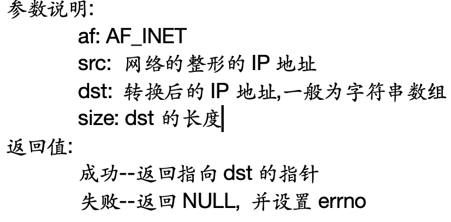

---


3.socket结构体

`sturct sockaddr`

```cpp
struct sockaddr_in {
         sa_family_t    sin_family; /* address family: AF_INET */
         in_port_t      sin_port;   /* port in network byte order */
         struct in_addr sin_addr;   /* internet address */
   };

/* Internet address. */
   struct in_addr {
         uint32_t  s_addr;     /* address in network byte order */127
   };	 //网络字节序IP--大端模式
```


4.整体流程

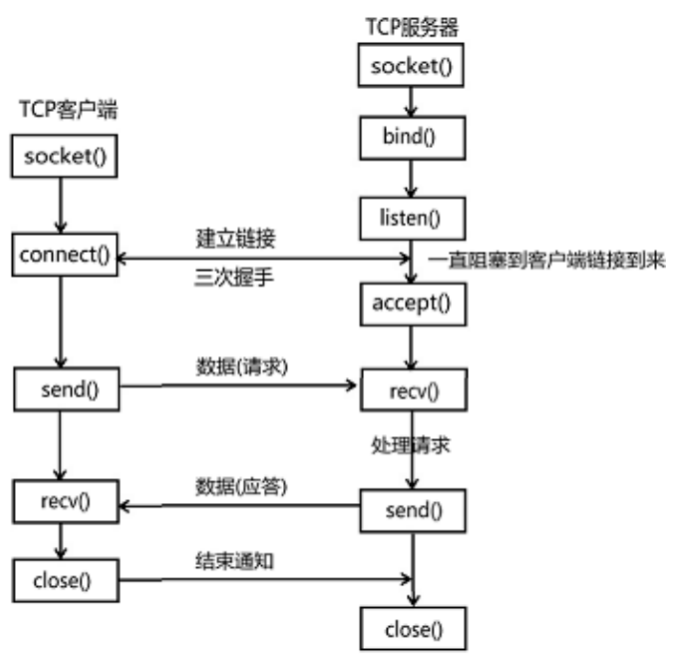

开发流程：

服务端：

​	创建socket，返回一个文件描述符

​		--用于监听客户端链接

​	将lfd与IP PORT进行绑定 bind()，客户端连接服务端时需要知道服务端的ip和端口，所以需要固定

​	将lfd由主动变被动 listen()

​	接受新链接 accept()，得到一个通信文件描述符

​	收发数据(一般先收再发)

​		{

​			接收---read、recv(read读普通文件为非阻塞，读管道、socket为阻塞)

​			发送---write、send

​		}		

​	关两个描述符---close()


客户端

​	创建socket，用来与服务端通信，内核会随机分配一个端口，所以不用绑定

​	连接服务端

​	收发数据

​	close

​	

## 实例

客户端

```cpp
//服务端程序
#include <stdio.h>
#include <stdlib.h>
#include <string.h>
#include <sys/types.h>
#include <unistd.h>
#include <arpa/inet.h>
#include <netinet/in.h>
#include <ctype.h>

int main()
{
	//创建socket
	//int socket(int domain, int type, int protocol);
	int lfd = socket(AF_INET, SOCK_STREAM, 0);
	if(lfd<0)
	{
		perror("socket error");
		return -1;
	}
	
	//int bind(int sockfd, const struct sockaddr *addr, socklen_t addrlen);
	//绑定
	struct sockaddr_in serv;
	bzero(&serv, sizeof(serv));
	serv.sin_family = AF_INET;
	serv.sin_port = htons(8888);
	serv.sin_addr.s_addr = htonl(INADDR_ANY); //表示使用本地任意可用IP
	int ret = bind(lfd, (struct sockaddr *)&serv, sizeof(serv));
	if(ret<0)
	{
		perror("bind error");	
		return -1;
	}

	//监听
	//int listen(int sockfd, int backlog);
	listen(lfd, 128);

	//int accept(int sockfd, struct sockaddr *addr, socklen_t *addrlen);
	struct sockaddr_in client;
	socklen_t len = sizeof(client);
	int cfd = accept(lfd, (struct sockaddr *)&client, &len);  //len是一个输入输出参数
	//const char *inet_ntop(int af, const void *src, char *dst, socklen_t size);
	
	//获取client端的IP和端口
	char sIP[16];
	memset(sIP, 0x00, sizeof(sIP));
	printf("client-->IP:[%s],PORT:[%d]\n", inet_ntop(AF_INET, &client.sin_addr.s_addr, sIP, sizeof(sIP)), ntohs(client.sin_port));
	printf("lfd==[%d], cfd==[%d]\n", lfd, cfd);

	int i = 0;
	int n = 0;
	char buf[1024];

	while(1)
	{
		//读数据
		memset(buf, 0x00, sizeof(buf));
		n = read(cfd, buf, sizeof(buf));
		if(n<=0) //关闭链接或客户端退出，<0 读取失败
		{
			printf("read error or client close, n==[%d]\n", n);
			break;
		}
		printf("n==[%d], buf==[%s]\n", n, buf);	

		for(i=0; i<n; i++)
		{
			buf[i] = toupper(buf[i]);
		}

		//发送数据
		write(cfd, buf, n);
	}

	//关闭监听文件描述符和通信文件描述符
	close(lfd);
	close(cfd);
	
	return 0;
}


```

运行过程，既可以在终端中用./运行，也可以在vscode中直接运行，打开另一个终端（ctrl+shift+5）使用`nc ip prot`进行测试

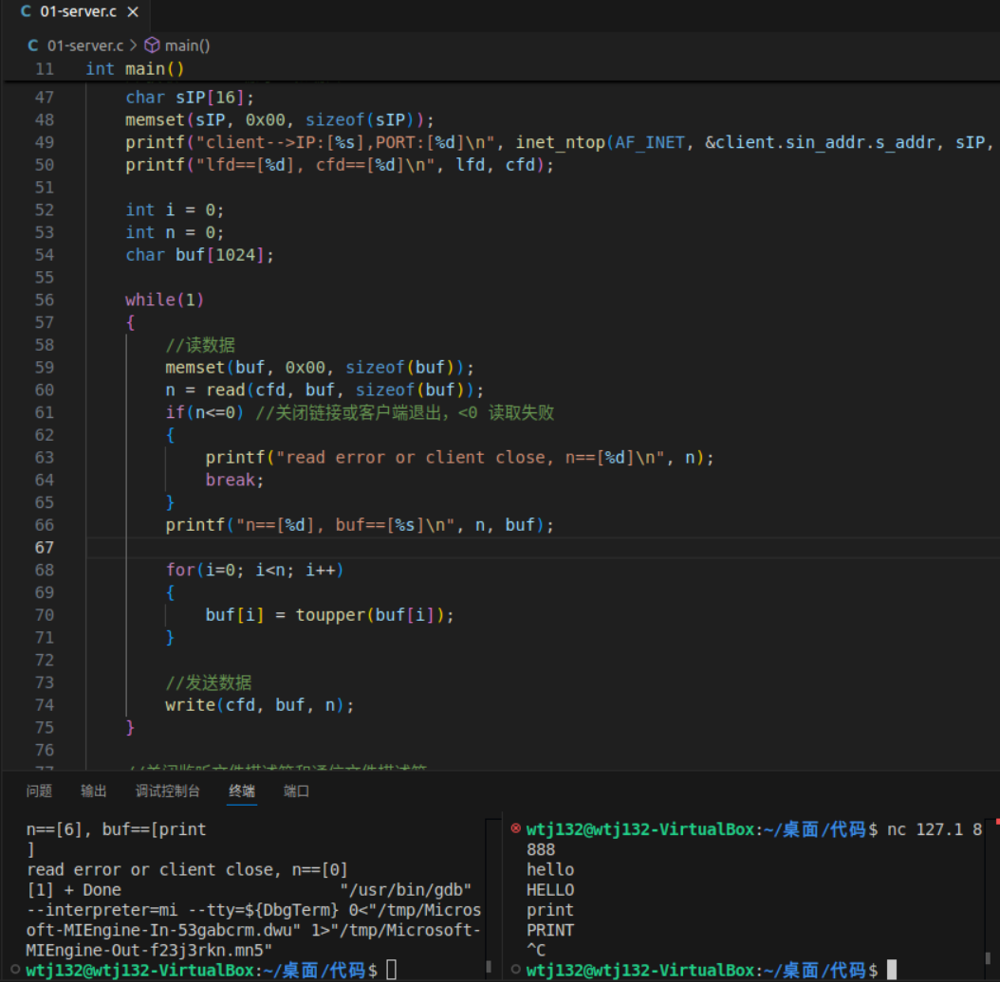

`netstat -anp | grep 8888`命令

```txt
tcp        1      0 127.0.0.1:49720         127.0.0.1:8888          CLOSE_WAIT  9018/02-client      
tcp        0      0 127.0.0.1:8888          127.0.0.1:49720         FIN_WAIT2   - 
```

细节：

​	调用accpet函数并没有新建连接，而是从已连接队列中拿取一个连接


# day2

> 1.三次握手
>
> 2.四次挥手
>
> 3.滑动窗口
>
> 4.错误处理函数的封装
>
> 5.多进程并发服务器
>
> 6.多线程并发服务器

##一.三次握手，四次挥手

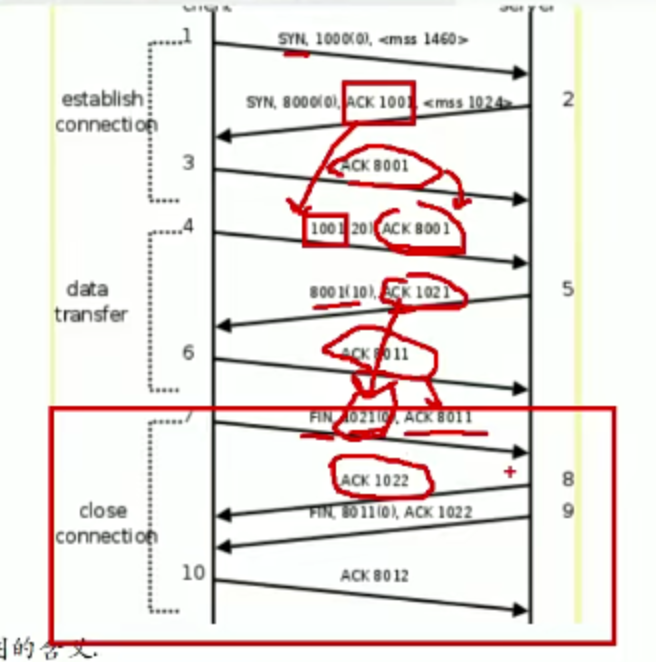

​	SYN建立连接命令，FIN结束连接命令，1000与8000均为随机起始值，后续所有的操作均在次基础上添加

​	ACK表示确认序号, 确认序号的值是对方发送的序号值+数据的长度, 特别注意的是SYN和FIN本身也会占用一位.


##二.滑动窗口

​	Win4096,缓冲区可用空间大小

​	mss 1460-》一次性可以接受数据的长度为1460

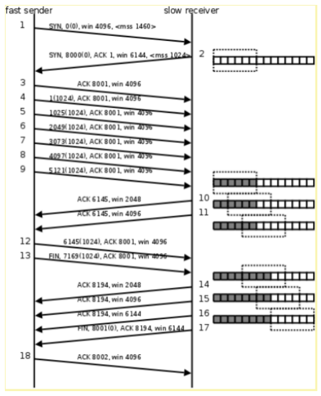

​	在客户端给服务端发包的时候, 不一定是非要等到服务端返回响应包, 由于客户端知道服务端的窗口大小, 所以可以持续多次发送, 当发送数据达到对方窗口大小了就不再发送, 需要等到对方进行处理, 对方处理之后可继续发送

​	==要能自己复述数据发送流程==


##三. 函数封装

​	阻塞函数在阻塞期间如果收到信号，会被信号打断，errno设置为EINTR(被信号打断)，具体错误类型可以调用man errno查看

> 4 EINTR Interrupted function call. An asynchronous signal (such as SIGINT
>
> ​       or SIGQUIT) was caught by the process during the execution of an
>
> ​       interruptible function. If the signal handler performs a normal
>
> ​       return, the interrupted function call will seem to have returned
>
> ​       the error condition.


##四.粘包问题和解决粘包问题

​	粘包: 多次数据发送, 收尾相连, 接收端接收的时候不能正确区分第一次发	送多少, 第二次发送多少.

> ==方案1: 包头+数据==
>
> ​	如4位的数据长度+数据  -----------> 00101234567890 
>
> ​	其中0010表示数据长度, 1234567890表示10个字节长度的数据.
>
> ​	另外, 发送端和接收端可以协商更为复杂的报文结构, 这个报文结	构就相当于双方约定的一个协议.
>
> 方案2: 添加结尾标记.
>
> ​	如结尾最后一个字符为\n \$等.
>
> 方案3: 数据包定长(接口)
> 	如发送方和接收方约定, 每次只发送128个字节的内容, 接收方接收定长128个字节就可以了.


## 五.多进程版服务器

当以下情况出现时，会导致无法实现多进程

```cpp
while(1){
    int cfd = accept();
    
    while(1){
        int n = read(cfd,buf,len); //如果client不发送数据，会导致read阻塞，无法继续进行，下一个client的请求就发不过来
        {
            if(n<=0) break;
        }
    }
    
}

//将cfd设置为非阻塞，使用fcntl函数

#include <stdio.h>
#include <fcntl.h>
#include <unistd.h>

// 将文件描述符设置为非阻塞模式
int set_nonblocking(int fd) {
    int flags;
    // 获取当前文件描述符的状态标志
    if ((flags = fcntl(fd, F_GETFL, 0)) == -1) {
        perror("fcntl F_GETFL");
        return -1;
    }
    // 设置非阻塞标志
    if (fcntl(fd, F_SETFL, flags | O_NONBLOCK) == -1) {
        perror("fcntl F_SETFL");
        return -1;
    }
    return 0;
}
```

​	如果有多个客户端请求，cfd只会保留最后一个文件描述符的值


<center>多进程</center>

​	

​	使用多进程，首先分清父子进程的功能，父进程负责监听和回收子进程，子进程负责处理

​	处理流程：

>   1.创建socket，得到lfd
>
>   2.将lfd与服务端ip，prot进行绑定bind（）
>
>   3.设置监听—listen（）
>
>   4.进入while
>
>   ```cpp
>   while(1){
>       cfd = accept(); //会被信号打断，子线程结束也是信号
>       //fork子进程
>       if(cfd == -1 && errno == EINTR){
>           continue;
>       }
>       pid = fork();
>       if(pid<0){
>           exit(-1);
>       }bin
>       else if(pid>0){//当前进程为父进程，父进程不需要收发数据
>           close(cfd);
>       }
>       else if(pid==0){//当前进程为子进程,子进程不需要监听
>         close(lfd);//进程是复制，lfd和cfd在父子中均有，线程是共享，关闭一个就都关闭了
>           while(1){
>               //收发数据
>               int n = read(cfd,buf,sizeof(buf));
>               if(n<=0)break;
>               write(cfd,buf,n);
>           }
>           close(cfd);
>           exit(0);
>       }
>   }
>   ```
>
>   ​	当 `accept` 函数被信号打断时，它会返回 -1，并且会把 `errno` 设置为 `EINTR`（Interrupted system call）。这意味着系统调用被信号中断了
>
>   ​	如果代码里没有对 `accept` 返回 -1 且 `errno` 为 `EINTR` 这种情况进行处理，那么程序会接着执行 `fork` 操作。不过，由于 `cfd` 是 -1，这就会致使后续的 `close(cfd)`、`read(cfd, buf, sizeof(buf))` 以及 `write(cfd, buf, n)` 这些操作出错，因为 -1 并非有效的文件描述符


<center>多线程</center>

```cpp	
//多线程版本的高并发服务器
#include <stdio.h>
#include <stdlib.h>
#include <string.h>
#include <sys/types.h>
#include <unistd.h>
#include <arpa/inet.h>
#include <netinet/in.h>
#include <ctype.h>
#include <pthread.h>
#include "wrap.h"

//子线程回调函数
void *thread_work(void *arg)
{
	// sleep(20);
	pthread_t tid = pthread_self();
	int cfd = *(int *)arg;
	printf("cfd==[%d]\n", cfd);
	printf("tid==[%lu]\n", (unsigned long)tid);
	int i;
	int n;
	char buf[1024];
	
	while(1)
	{
		//read数据
		memset(buf, 0x00, sizeof(buf));
		n = Read(cfd, buf, sizeof(buf));
		if(n<=0)
		{
			printf("read error or client closed,n==[%d]\n", n);
			break;
		}
		printf("n==[%d], buf==[%s]\n", n, buf);
		
		for(i=0; i<n; i++)
		{
			buf[i] = toupper(buf[i]);
		}
		//发送数据给客户端
		Write(cfd, buf, n);	
	}
	
	//关闭通信文件描述符
	close(cfd);
	
	pthread_exit(NULL);
}
int main()
{
	//创建socket
	int lfd = Socket(AF_INET, SOCK_STREAM, 0);
	
	//设置端口复用
	int opt = 1;
	setsockopt(lfd, SOL_SOCKET, SO_REUSEADDR, &opt, sizeof(int));
	
	//绑定
	struct sockaddr_in serv;
	bzero(&serv, sizeof(serv));
	serv.sin_family = AF_INET;
	serv.sin_port = htons(8888);
	serv.sin_addr.s_addr = htonl(INADDR_ANY);
	Bind(lfd, (struct sockaddr *)&serv, sizeof(serv));
	
	//设置监听
	Listen(lfd, 128);
	
	int cfd;
	pthread_t threadID;
	while(1)
	{
		//接受新的连接
		cfd = Accept(lfd, NULL, NULL);
		
		//创建子线程
		pthread_create(&threadID, NULL, thread_work, &cfd);
		
		//设置子线程为分离属性
		pthread_detach(threadID);
	}

	//关闭监听文件描述符
	close(lfd);
	
	return 0;
}

```

> 在以下这段代码中
>
> ​	为什么只有1个threadID，却能创建多个线程---因为每次创建都会覆盖之前的，相当于养好了就放出去不用在管了，cfd同理
>
> ```cpp
> 	int cfd;
> 	pthread_t threadID;
> 	while(1)
> 	{
> 		//接受新的连接
> 		cfd = Accept(lfd, NULL, NULL);
> 		
> 		//创建子线程
> 		pthread_create(&threadID, NULL, thread_work, &cfd);
> 		
> 		//设置子线程为分离属性
> 		pthread_detach(threadID);
> 	}
> ```
>
> - 程序会接受一个新的连接，得到对应的文件描述符 `cfd`。
> - 调用 `pthread_create` 函数创建一个新的线程，把新线程的 ID 存于 `threadID` 变量。
> - 调用 `pthread_detach` 函数将这个新线程设置为分离状态
>
> ​	虽然 `threadID` 变量是同一个，但每次调用 `pthread_create` 时，操作系统都会创建一个全新的线程，并且把新线程的唯一 ID 写入 `threadID`。每次循环里新创建的线程的 ID 都会覆盖掉之前存储在 `threadID` 里的 ID

补充，文件标识符和普通int的区别

> ​	不和read、accept这种函数使用的话没有区别，如果可以保证int p 是一个有效的文件标识符，二者也可以等价，文件标识符之所以特殊，是因为他时刻和某个资源绑定，就如同身份证id一样
>
> 1. **文件描述符的进程内唯一性**
>    - `fd` 仅在 **当前进程内唯一**，不同进程中相同数值的 `fd` 可能指向不同的资源。
>    - 例如：进程 A 中 `fd=3` 指向文件 `a.txt`，进程 B 中 `fd=3` 可能指向文件 `b.txt` 或套接字。
>
> ```cpp
> //
> // Created by 王天 on 2025/4/24.
> //
> #include <stdio.h>
> #include <unistd.h>
> #include <fcntl.h>
> #include <errno.h>
> #include <_stdlib.h>
> #include <iostream>
> int main() {
>     int fd = open("file.txt", O_RDWR);
>     if (fd == -1) {
>         perror("open");
>         exit(1);
>     }
>     std::cout<<fd<<std::endl;
>     int p = 3;
>     char buf[100];
>     ssize_t n = read(p,buf,100);
>     std::cout<<n<<std::endl;
>     for (int i=0;i<n;i++) {
>         std::cout<<buf[i];
>     }
>     std::cout<<std::endl;
> 
> }
> /*
> 3
> 41
> dafj;asdkjf;aksjdf;kajsdfjhlajsdfhljkasdf
>  */
> 
> ```
>
> 

