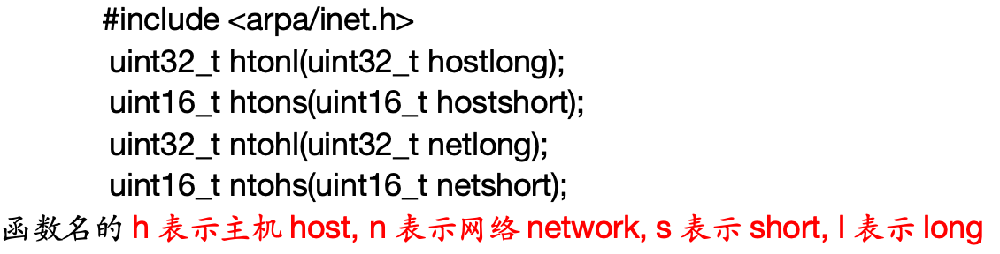

# day1

## 基础概念

1.协议

事先定好的传输解释规则


2.OSI七层模型

3.TCP/IP四层模型


4.数据通信过程


5.设计模式

5.1 CS设计模式

> ​	传统的网络应用设计模式，客户机(client)/服务器(server)模式。需要在通讯两端各自部署客户机和服务器来完成数据通信。
>
> ftp协议

5.2 BS设计模式

> 浏览器(broswer)/服务器(server)模式。只需在一端部署服务器，而另外一端使用每台PC都默认配置的浏览器即可完成数据的传输。
>
> http协议


6.常用协议

6.1 以太网帧


目的地址=硬件地址=mac地址，使用ifconfig访问

源地址=硬件地址，信息发出


CRC校验


例子：ARP请求

> ARP请求为了确认目的地址，当前发送端只知道目的端的ip地址，因此通过发送端发送ARP广播, 接收到该ARP数据的主机先判断是否是自己的IP, 若是则应答一个ARP应答报文, 并将mac地址填入应答报文中; 


6.2 IP协议


==8位生存时间ttl(网络连接下一跳的次数): 为了防止网络阻塞==


6.3 UDP协议


端口：

> - 服务器相当于 “一栋大楼”（IP 地址是大楼的门牌号），
> - 端口相当于 “大楼内的不同房间”（每个房间对应一个服务，如 80 号房间是 Web 服务，21 号房间是 FTP 服务）。
>   当客户端发送请求时，需同时指定 “大楼地址”（IP）和 “房间号”（端口），才能准确找到目标服务。
> - 通过


6.4 TCP协议


==32位序号和32位确认序号==

​	如何将大文件拼接起来(序号)，确认是否收到数据(确认序号)

==ACK、SYN、FIN==

16位窗口大小

​	防止发送过快导致信息丢失

---


## 二.SOCKET编程

> socket会建立一个文件描述符，操作两个缓冲区
>
> 

---


1.关键api

==int socket(int domain, int type, int protocol);==

> domain: 协议版本
>
> ​	AF_INET IPV4
>
> ​	AF_INET6 IPV6
>
> ​	AF_UNIX AF_LOCAL本地套接字使用
>
> type:协议类型
>
> ​	SOCK_STREAM 流式, 默认使用的协议是TCP协议
>
> ​	SOCK_DGRAM  报式, 默认使用的是UDP协议
>
> protocal: 
>
> ​	一般填0, 表示使用对应类型的默认协议.
>
> 返回值: 
>
> ​	成功: 返回一个大于0的文件描述符
>
> ​	失败: 返回-1, 并设置errno


==int bind(int sockfd, const struct sockaddr *addr, socklen_t addrlen);==

​	将socket文件描述符和IP,PORT绑定

> 参数说明:
>
> ​	socket: 调用socket函数返回的文件描述符
>
> ​	addr: 本地服务器的IP地址和PORT, 
>
> ​	struct sockaddr_in serv;
>
> ​	serv.sin_family = AF_INET;
>
> ​	serv.sin_port = htons(8888);
>
> ​	//serv.sin_addr.s_addr = htonl(INADDR_ANY);
>
> ​	//INADDR_ANY: 表示使用本机任意有效的可用IP
>
>  	如果要自己指定地址：
>
> ​	inet_pton(AF_INET, "127.0.0.1", &serv.sin_addr.s_addr);
>
> ​	addrlen: addr变量的占用的内存大小 
>
> 返回值: 
>
> ​	成功: 返回0
>
> ​	失败: 返回-1, 并设置errno


==int listen(int sockfd, int backlog);==

​	将套接字由主动态变为被动态


==int accept(int sockfd, struct sockaddr *addr, socklen_t *addrlen);==

​	获得一个连接, 若当前没有连接则会阻塞等待.

​	文件描述符有两种，在调用listen后，为监听文件描述符和用于通信的文件描述符

> 函数参数:
>
> ​	sockfd: 调用socket函数返回的文件描述符
>
> ​	addr: 传出参数, 保存客户端的地址信息
>
> ​	addrlen: ==传入传出参数==,  addr变量所占内存空间大小
>
> 返回值:
>
> ​	成功: 返回一个==新的文件描述符,用于和客户端通信==
>
> ​	失败: 返回-1, 并设置errno值. 

​	

==int connect(int sockfd, const struct sockaddr *addr, socklen_t addrlen);==

​	连接服务器，由客户端调用，客户端只有一类文件描述符，用于传输

> 函数参数:
>
> ​	sockfd: 调用socket函数返回的文件描述符
>
> ​	addr: 服务端的地址信息
>
> ​	addrlen: addr变量的内存大小
>
> 返回值:
>
> ​	成功: 返回0
>
> ​	失败: 返回-1, 并设置errno值

读取数据和发送数据:

```cpp
ssize_t read(int fd, void *buf, size_t count);
ssize_t write(int fd, const void *buf, size_t count);
ssize_t recv(int sockfd, void *buf, size_t len, int flags);
ssize_t send(int sockfd, const void *buf, size_t len, int flags);	
```


---


2.预备知识

a.字节序

​	大端：低位地址存放高位数据, 高位地址存放低位数据

​	小端：低位地址存放低位数据, 高位地址存放高位数据

 ```cpp
 #include <stdio.h>
 #include <stdlib.h>
 
 union {
     short s;
     char c[sizeof(short)];
 } un2;
 
 union {
 	int s;
 	char c[sizeof(int)];
 }un4;
 
 int main()
 {
 	printf("[%d][%d][%d]\n", sizeof(short), sizeof(int), sizeof(long int));
 
 	//测试short类型
     un2.s = 0x0102;// 0x0102 =? 16*16+2
     printf("%d,%d,%d\n",un2.c[0],un2.c[1],un2.s);
 
 	//测试int类型
 	//un4.s = 0x12345678;
 	un4.s = 0x01020304;
 	printf("%d,%d,%d,%d,%d\n", un4.c[0], un4.c[1], un4.c[2], un4.c[3], un4.s);
     return 0;
 }
 ```

b.大小端转换

​	==网络传输用的是大端法, 如果机器用的是小端法, 则需要进行大小端的转换.==



c.IP地址转换

​	将字符串形式的点分==十进制IP==转换为==大端模式的网络IP==(整形4字节数)

 `int inet_pton(int af, const char *src, void *dst);`

src为传入的十进制ip地址，dst为转化完存放的地址

将大端网络转为十进制IP

​	`const char *inet_ntop(int af, const void *src, char *dst, socklen_t size);`


---


3.socket结构体

`sturct sockaddr`

```cpp
struct sockaddr_in {
         sa_family_t    sin_family; /* address family: AF_INET */
         in_port_t      sin_port;   /* port in network byte order */
         struct in_addr sin_addr;   /* internet address */
   };

/* Internet address. */
   struct in_addr {
         uint32_t  s_addr;     /* address in network byte order */
   };	 //网络字节序IP--大端模式
```


4.整体流程


开发流程：

服务端：

​	创建socket，返回一个文件描述符

​		--用于监听客户端链接

​	将lfd与IP PORT进行绑定 bind()

​	将lfd由主动变被动 listen()

​	接受新链接 accept()，得到一个通信文件描述符

​	收发数据(一般先收再发)

​		{

​			接收---read、recv(read读普通文件为非阻塞，读管道、socket为阻塞)

​			发送---write、send

​		}		

​	关两个描述符---close()

​	


