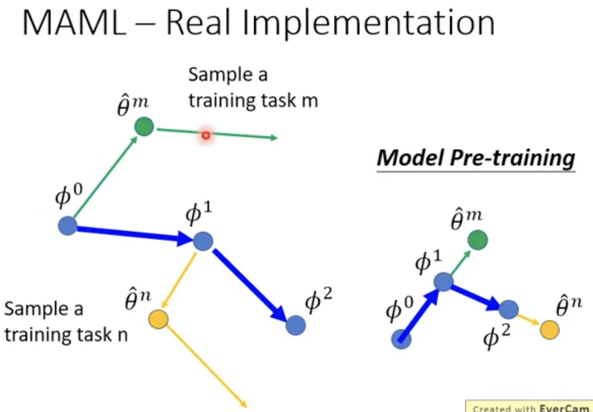
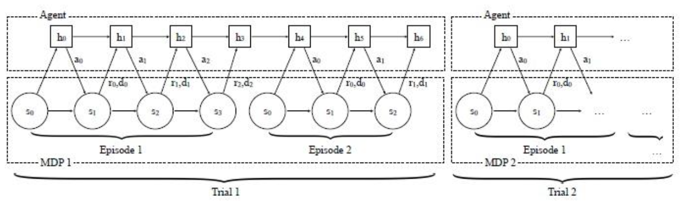

# 强化学习

## PPO

### pytorch

1.采样

BatchSampler/SubsetRandomSampler

```py
import torch
from torch.utils.data.sampler import BatchSampler ,SubsetRandomSampler

#torch.utils.data.BatchSampler(sampler, batch_size, drop_last)
#eg1
a=[i for i in range(10)]
sample=BatchSampler(a,3,True)
# for i in sample:
#     print(i)

# [0, 1, 2]
# [3, 4, 5]
# [6, 7, 8]

#torch.randperm(n)用于生成从0到n-1de随机排列数组
torch.randperm(10) 
# tensor([2, 3, 5, 7, 4, 6, 9, 8, 0, 1])
torch.randperm(20)[5:10] #可以用于随机采样的索引
#tensor([ 6,  3, 13, 19,  2])

#subsetrandomsampler 等同于一个随机采样，返回一个迭代器
b=[i for i in range (100)]
sample=SubsetRandomSampler(b)
# for i in sample:
#     print(i)

sample=BatchSampler(SubsetRandomSampler([i for i in range(64)]),10,False)
for i in sample:
    print(i)

# [57, 56, 13, 45, 36, 49, 41, 37, 40, 30]
# [61, 38, 14, 11, 2, 44, 39, 33, 52, 34]
# [3, 21, 48, 63, 17, 25, 42, 23, 26, 46]
# [60, 10, 5, 59, 47, 16, 22, 32, 12, 24]
# [7, 9, 8, 58, 28, 6, 62, 19, 51, 27]
# [15, 31, 53, 18, 43, 55, 0, 35, 1, 4]
# [20, 50, 54, 29]
```


# 元强化学习

## 元学习

meta learning：学习如何学习

学习的过程也可以被视为一种函数，这个函数的输入是数据集，输出是分类函数

元学习所学习的就是这个函数


component是要学习的参数，不同的元学习方法就是学习不同的参数

定义损失函数和学习算法

对于元学习来说，训练的样本是不同的任务，如二元分类，就需要准备多种不同二元分类任务，将输出的分类函数的好坏作为元学习函数的损失


2.找到$\phi$使$F^\phi$最优

由于梯度不能反向传播，可以使用强化学习或者遗传算法进行求解


3.问题与不足

每次计算损失函数需要大量的计算，先使用训练数据得到分类器，再根据分类器的好坏评价元学习的好坏，此时，将跨任务训练叫做外循环，对每个任务还需进行多次训练（获得损失函数进行优化）叫做内循环


4.MAML为什么好（特点）

- 元学习找到的参数可以迅速找到不同任务的最优参数
- 元学习找到了与多种任务最优很接近的参数


一些MAML变形

FOMAML

Reptile

 5.学习优化器

能不能学习更新的参数（学习梯度下降参数）相当于学习一个优化器


6.学习网络架构


7.更新参数方法

相关文献：


8.学习如何数据增强


9.采样权重


10.超越梯度下降方法


直接输出最终结果


### MAML

1.定义需要学习的学习参数集合


在传统训练过程中，有很多环节是由人工设计的，如网络架构，初始参数，更新环节（更新方法，学习率等参数）

2.定义学习学习函数（Function F）的好坏


3.MAML创新

学习初始化参数$\phi$


#### 4.MAML与pre-training的区别


MAML并不在意训练集中的表现，更在意训练出来的参数表现如何，而pre-training更在意找到在所有当前task中表现更好的模型

MAML：找到可以在后续训练中表现更好的初始化参数$\phi$

pre-training：找到在当前所有task中表现最好的$\phi$

| MAML                                                         | pre-training                                                 |      |
| ------------------------------------------------------------ | ------------------------------------------------------------ | ---- |
| 未来潜力                                                     | 当前最优                                                     |      |
| 找到一个 “可快速适应新任务” 的初始化参数 *ϕ*。这个 *ϕ* 本身在当前任务上的表现可能不是最佳，但经过 **少量样本 / 几步梯度更新** 后，能在**新任务**上表现优异。 | 找到一个在**当前所有任务 / 数据**上表现最佳的初始化参数 *ϕ*。这个 *ϕ* 直接在预训练任务上经过充分优化，追求 “当下最优”，后续微调时通常需要更多数据或训练步骤。 |      |
|                                                              |                                                              |      |

MAML应用场景：

- **少样本学习（Few-Shot Learning）**：新任务数据极少（如每个类别仅 1-5 个样本），要求模型通过少量梯度更新快速适应。
- **元学习（Meta-Learning）**：在多个 “元任务” 上训练，让模型学会 “如何学习”（Learning to Learn），核心是优化初始化参数的 “可更新性”。

pre-training：

- **通用模型迁移**：在大规模数据（如 ImageNet、海量文本）上预训练，然后在相关任务（如物体检测、情感分类）上微调，依赖 “预训练任务与目标任务的强相关性”。
- **关键特点**：$\phi$ 本身在预训练任务上已足够强，微调时更注重 “在相似任务上进一步优化”，而非极端少样本场景。


#### 5.MAML数学知识

在训练时，只对由元学习（$\phi$）产生的分类器（$\theta _{i}$）进行一次更新，后直接计算损失进行反向传播


6.MAML的应用



对于MAMl来说，初始参数$\phi_0$对于任务m进行一次梯度更新-》$\theta^m$，在对$\theta^m$进行一次损失函数的计算，并根据第二次损失的梯度方向进行更新，对任务n同理

而预训练则是简单的直接在第一次损失函数计算后就进行更新


## 元强化学习经典方法（论文）

### $RL^2$

$RL^2$: Fast Reinforcement Learning via Slow Reinforcement Learning



RL2将传统的强化学习分为inner-loop和outter-loop，内循环（trial）中使用RNN智能体与环境进行交互n次（每次reset算作交互完成一次）

隐藏状态（h）仅在同一个task（trial）中进行保留，在这种结构下，智能体的目标不是最大化一局的收益，而是最大化一个trial的收益

做法：将每个环境视为一个 “trial”，在元训练阶段让智能体经历多个 trials，每个 trial 包含少量 episodes（如 1-5 个），目标是让智能体从初始参数 \(\theta_0\) 出发，通过极少量 episodes 的梯度更新（内循环），快速在该 trial 中达到高奖励。

优化逻辑：

- 外循环优化初始参数 \(\theta_0\)，使得对任意 trial，内循环更新后的策略 \($\theta_k = \theta_0 + \alpha \nabla_{\theta_0} R_{\text{trial}}(\theta_0)$) 在该 trial 的后续 episodes 中奖励飙升。
- 核心是让 \(\theta_0\) 具备 “快速学习的能力”，而非直接在每个环境中表现最优。

关键优势：

- 对**新 trial（未训练过的环境）**，仅需 1-2 个 episodes 就能从低奖励快速提升到高奖励，而传统混合训练需要数十个 episodes 才能适应（甚至无法适应分布外环境）。

例子：

- 元训练阶段：在多个迷宫（trials）上训练，每个迷宫中智能体先用前 2 个 episodes 探索（学习该迷宫的局部特征），后 3 个 episodes 利用元学习得到的初始策略（如 “优先探索边界”“记忆死胡同”），快速找到出口。
- 切换到新迷宫时，初始策略已包含 “通用探索策略”，只需少量 episodes 调整即可适应，整个 trial 的总收益（5 个 episodes 的累计收益）远高于传统 RL。
- **优势**：通过跨 trial 的元学习，智能体学会了 “如何高效探索新环境”，而非仅记住单个环境的最优路径。


