# 强化学习

## PPO

### pytorch

1.采样

BatchSampler/SubsetRandomSampler

```py
import torch
from torch.utils.data.sampler import BatchSampler ,SubsetRandomSampler

#torch.utils.data.BatchSampler(sampler, batch_size, drop_last)
#eg1
a=[i for i in range(10)]
sample=BatchSampler(a,3,True)
# for i in sample:
#     print(i)

# [0, 1, 2]
# [3, 4, 5]
# [6, 7, 8]

#torch.randperm(n)用于生成从0到n-1de随机排列数组
torch.randperm(10) 
# tensor([2, 3, 5, 7, 4, 6, 9, 8, 0, 1])
torch.randperm(20)[5:10] #可以用于随机采样的索引
#tensor([ 6,  3, 13, 19,  2])

#subsetrandomsampler 等同于一个随机采样，返回一个迭代器
b=[i for i in range (100)]
sample=SubsetRandomSampler(b)
# for i in sample:
#     print(i)

sample=BatchSampler(SubsetRandomSampler([i for i in range(64)]),10,False)
for i in sample:
    print(i)

# [57, 56, 13, 45, 36, 49, 41, 37, 40, 30]
# [61, 38, 14, 11, 2, 44, 39, 33, 52, 34]
# [3, 21, 48, 63, 17, 25, 42, 23, 26, 46]
# [60, 10, 5, 59, 47, 16, 22, 32, 12, 24]
# [7, 9, 8, 58, 28, 6, 62, 19, 51, 27]
# [15, 31, 53, 18, 43, 55, 0, 35, 1, 4]
# [20, 50, 54, 29]
```


# 元强化学习

## 元学习

meta learning：学习如何学习

学习的过程也可以被视为一种函数，这个函数的输入是数据集，输出是分类函数

元学习所学习的就是这个函数

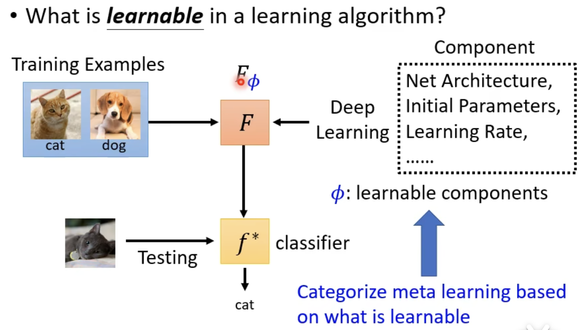

component是要学习的参数，不同的元学习方法就是学习不同的参数

定义损失函数和学习算法

对于元学习来说，训练的样本是不同的任务，如二元分类，就需要准备多种不同二元分类任务，将输出的分类函数的好坏作为元学习函数的损失

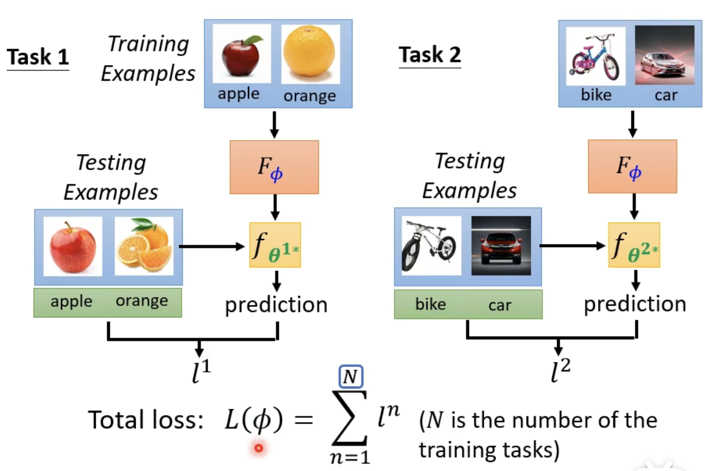

2.找到$\phi$使$F^\phi$最优

由于梯度不能反向传播，可以使用强化学习或者遗传算法进行求解


3.问题与不足

每次计算损失函数需要大量的计算，先使用训练数据得到分类器，再根据分类器的好坏评价元学习的好坏，此时，将跨任务训练叫做外循环，对每个任务还需进行多次训练（获得损失函数进行优化）叫做内循环

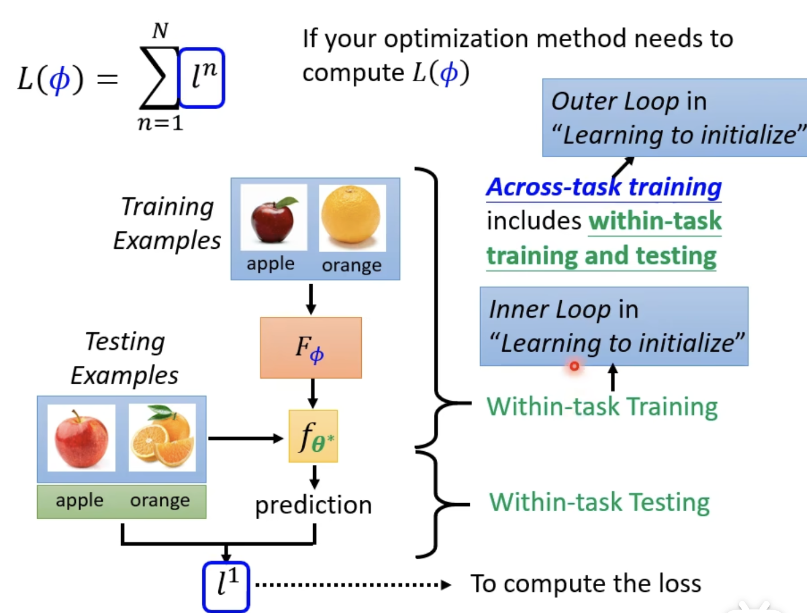


4.MAML为什么好（特点）

- 元学习找到的参数可以迅速找到不同任务的最优参数
- 元学习找到了与多种任务最优很接近的参数

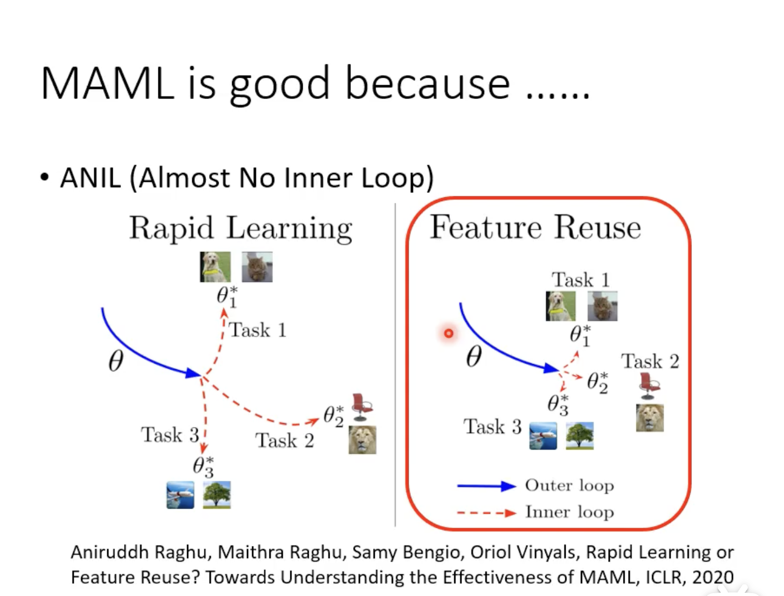

一些MAML变形

FOMAML

Reptile

 5.学习优化器

能不能学习更新的参数（学习梯度下降参数）相当于学习一个优化器


6.学习网络架构

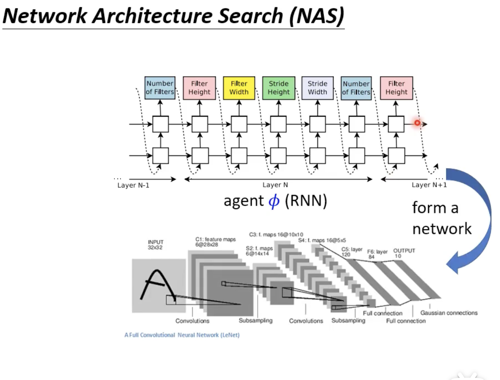


7.更新参数方法

相关文献：

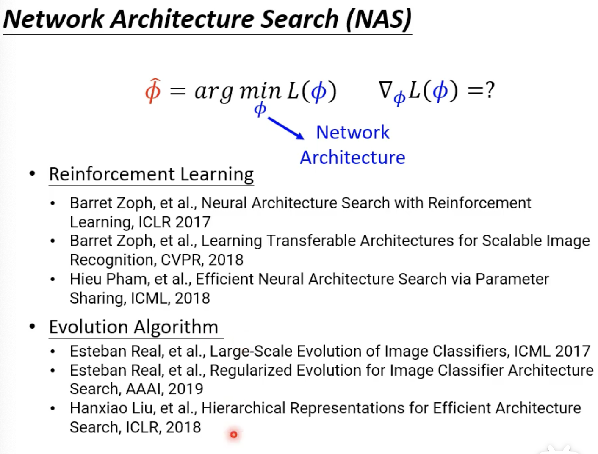


8.学习如何数据增强

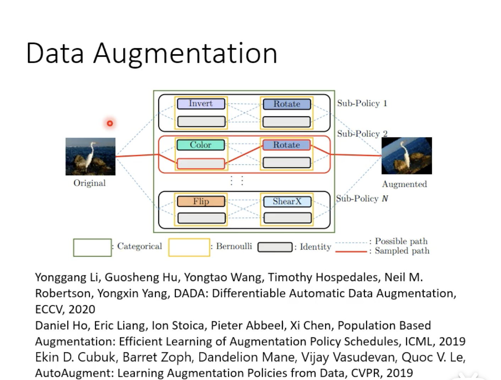


9.采样权重

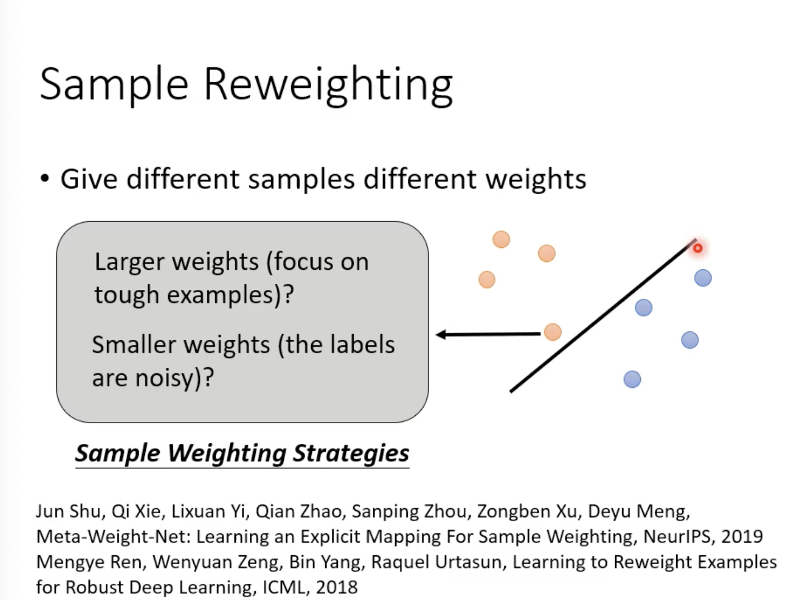


10.超越梯度下降方法

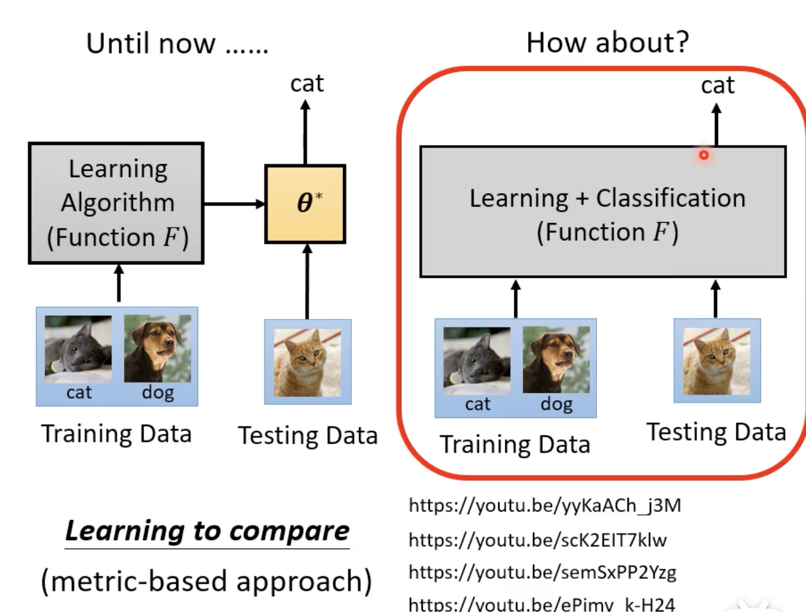

直接输出最终结果


##### MAML

1.定义需要学习的学习参数集合

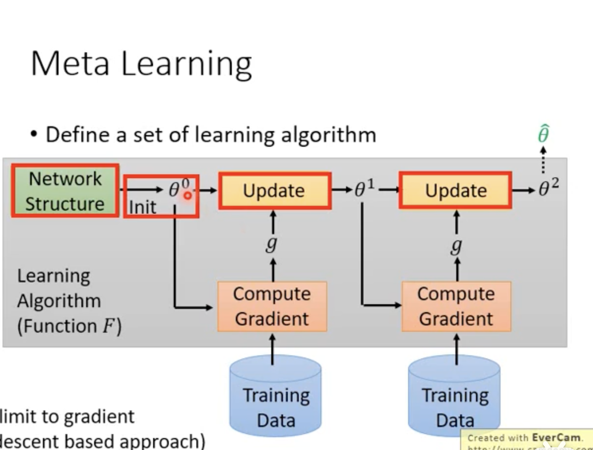

在传统训练过程中，有很多环节是由人工设计的，如网络架构，初始参数，更新环节（更新方法，学习率等参数）

2.定义学习学习函数（Function F）的好坏

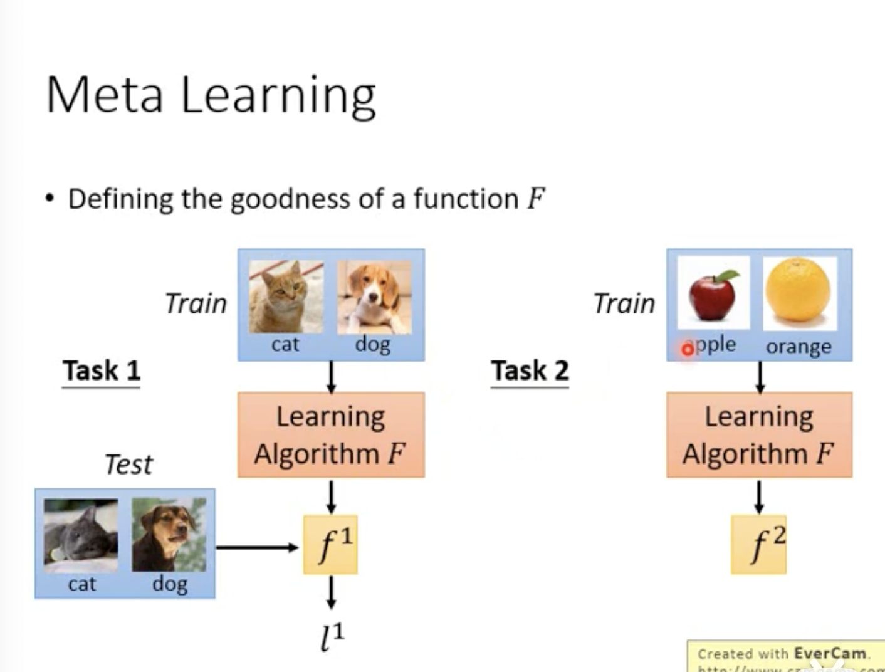


3.MAML创新

学习初始化参数$\phi$

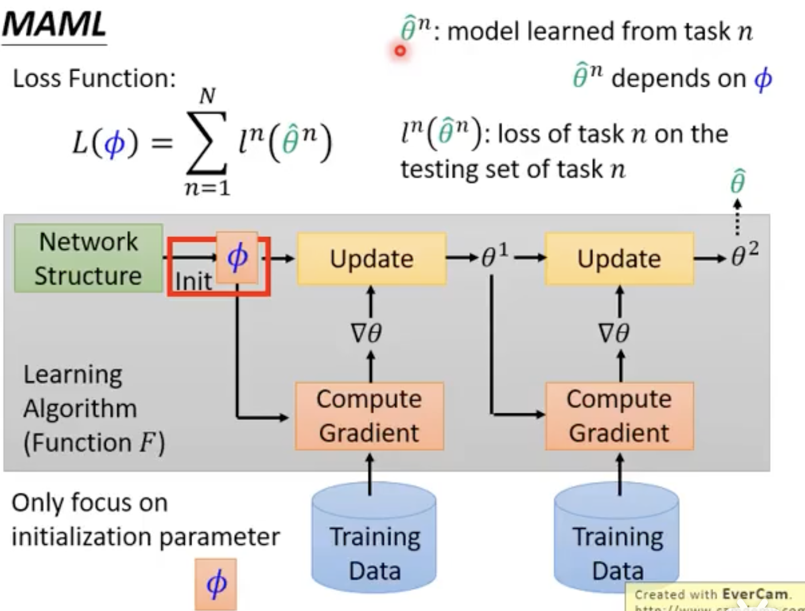


4.MAML与pre-training的区别

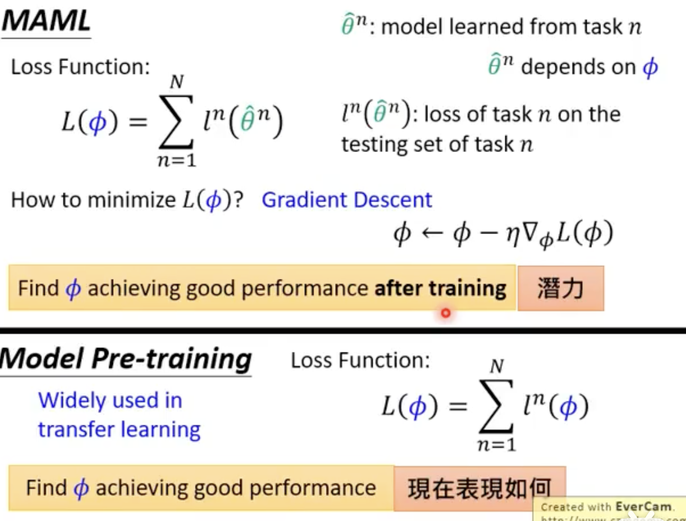

MAML并不在意


